&emsp;

   

&emsp;

# 5 课程安排

- 按照 "用到再写" 原则讲解，尽量不去关注还没用上的实现

### （1）NeRF 基本介绍

### （2）NeRF Synthetic 数据集的处理

- DatasetProvider 类
  - 解析所有图片 images
  - 解析每张图片对应的相机位姿 $T_{wc}$
    - $R$: 相机坐标系到世界坐标系旋转矩阵
    - $t$: 平移向量，相机坐标系原点在世界坐标系下的表示
  - 计算每张图片对应的相机焦距，用于将像素坐标转换成相机坐标
  - 将 $(R, G, B, alpha)$ 转换为 $(R, G, B)$
- NeRFDataset 类
  - 生成每一张图片的像素坐标
  - 生成 precrop 的坐标的索引
  - 将像素坐标转换成 COLMAP 坐标系
  - make_rays
    - 将 COLMAP 坐标系转成常用 Camera 坐标系
    - 将 Camera 坐标系转成 World 坐标系
    - 取出位姿中的 Camera 坐标系在 World 坐标系下表示的原点
  - 完成类的两个特性：求长度、索引

### （3）NeRF 模型建模

- 根据论文模型建模
- 傅里叶特征位置编码（Positional Encoding）
- 视图独立性与无视图独立性的实现

### （4）训练

- 体素渲染
  - 光线采样
    - 在光线上采样 $n$ 个点，计算每个点的 z 值
    - 对每个点进行光线建模
  - 视图采样，将坐标转换成归一化坐标系上的坐标
  - coarse 模型
  - 推理得出 $RGB_{coarse}$ 和权重 $W_{coarse}$
  - 用 weigths 对光线的 z 值进行重采样并重新构建光线模型
  - fine 模型
  - 推理得出 $RGB_{fine}$ 和权重 $W_{fine}$
- 模型 backward

### （5）360° 渲染

​            
​        

# 概述

NeRF、Mip-NeRF和Instant-NGP三篇是NeRF论文的基础，其中Mip-NeRF是从视觉质量方面改进，Instant-NGP是从速度方面改进，甚至重新设计了NeRF架构

总的来说，NeRF实际上就是一种隐式表达三维信息的网络，只能输出特定视角下的二维图像

# NeRF开山之作

NeRF的贡献是，提出了一种可以端到端的视角合成方法，使用神经网络去学习多视角图像中的光线，然后在任意视角去看的时候就可以将其投影为图像

NeRF实际上所做的事情，就是映射一个 3D 场景，或者说从一系列的图像（以及拍摄的位姿）中学习如何映射和渲染一个场景，然后给出一个新的拍摄位姿，就可以渲染出来一个新的图像

NeRF模型的输入，实际上就是将物体进行稀疏表示为单个粒子，然后输入粒子的位姿，输出则是粒子的密度和颜色，然后将粒子进行渲染得到图像，渲染过程如下

- 渲染过程
  - 给定任意一个位姿
  - 根据这个位姿及其对应的画布上的像素坐标 $(u, v)$ 构建出和对应的射线
  - 经过两个模型（coarse、fine）推理出 $RGB$ 和 $\sigma$，就可以渲染了
  - 以此推广到每一帧，连续起来就成了视频，或实时 3D 渲染

## 神经辐射场

下图是文章中的第二个图，首先其假设了我们感兴趣的物体是在一个空间立方体中的，然后通过相机的投影投射到图像上得到我们看到的图像。这个过程中可以认为三维空间上的某个粒子，其发出的光线颜色投影到了图像上的点（像素坐标），但是NeRF是考虑了一个线上所有的点进行渲染的，但是这是怎么一个过程呢

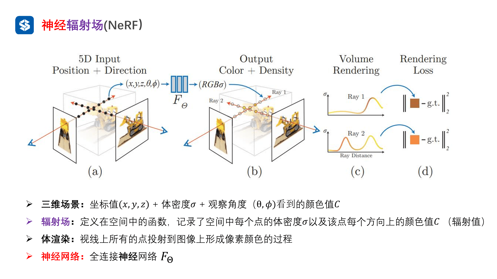

首先，每个三维空间点都有一个三维坐标，然后每个地方都认为有一个体密度，其被认为与材质有关，然后就是观察角度，论文中认为观察角度的不同会导致看到的颜色值不同，这是考虑了镜面反射的情况，否则颜色就会跟视角独立的，这样就可以表达三维空间中的每个点

那么什么是辐射场呢，辐射场的定义如上图所示，但是怎么定义辐射场呢？如何记录这么多的信息呢，实际上就是通过神经网络去记录或者说去学习这种表示，或者说，NeRF是通过一个

因为有了神经网络模块，所以NeRF实际上也分为训练和推理两个环节，在推理的时候，输入空间中视线上每个点的信息（五个维度总共，实际上就是不同粒子的位姿），然后使用神经网络去查询，得到不同点的信息，并且最终按照体渲染的方式，合并光线或者色彩信息并且输出最终的图像颜色信息，当对每个点的推理都完成之后，就得到了一张图像

训练部分就是使用均方误差来反向传播进行训练

## 体渲染

首先去研究视线是如何去表达的，如下图所示，实际上是使用俯仰角和偏航角去进行表达，因为实际上不需要去关注深度信息（神经辐射场会考虑视线上所有点的特征）并且滚转角（沿着射线自身的旋转）没有意义，故只需要两个参数来表达视线方向

但是到真实使用的时候，射线表示为：
$$
r(t)=o+td
$$
通过上式来完成采样，就可以得到视线上点的三维空间坐标（基于世界坐标系），然后进行进一步的渲染操作

然后体渲染是什么呢？如下图所示，实际上就是三维投影到二维的一个过程，是渲染技术的一个分支，目的是为了解决非刚性物体（如云、烟、果冻等）的渲染建模问题，思想是将物质抽象成为一团飘忽不定的粒子群，光线的穿过就是光线与粒子进行碰撞的过程，这从数学上看就是一个积分过程，对视线上的所有点的信息进行聚合

当然，这里是需要一个先验信息，也就是积分的范围，也就是三维场景近端和远端边界，否则积分范围就是零到无穷大，这是无法完成的，也就是在具体渲染的应用中要预先给定这个范围

从物理上理解，体渲染方法中很重要的一个点就是体密度函数，其与当前点的物理属性密切相关，可以认为，点的物理属性就是此位置的物理材质吸收光线的能力，零表示不吸收光线，无穷大认为是完全吸收光线，介于两种情况之间的话，就是吸收一部分光线、透过一部分光线，从而且只要吸收了光线，此处的点就可以被看到，但是光线强度也会随之减弱，所以使用一个变量 $T(t)$ 来衡量光强，当光强为零的时候就无法看到此处的点，而光强显然与吸光材质有关

那么光强如何表达呢？可以表示为射线上点的积分，并且使用一个非线性函数 Sigmoid 来映射到一个标准区间，并且进行积分和指数映射，当光强降低到零之后，后面点的颜色在数值上已经不参与运算了

其中，如果一个点的吸光强度很大，并且光照强度也很大，那么其会对最终成像的点产生更大的影响

当然，计算机无法处理连续变量，所以必须使用离散的体渲染技术，而离散化就涉及了采样的步骤，如果均匀采样，就可能导致采样不准确的情况（比如说某个峰值没有采样到），所以就使用了一种新的分层采样方法，均匀分出若干区间，然后每个区间中随机采样

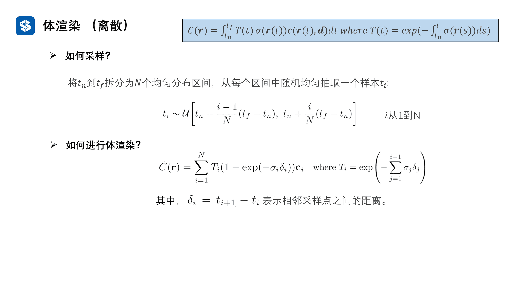

如此，就可以完成一个视线上的体渲染，当然，一个图像对应非常多的射线，可以说一个像素点就对应一个视线，所以一个尺寸为 (H,W) 的图像就有 (H,W) 个射线或者视线

## 神经网络和位置编码

神经网络的输入并不是原始的坐标信息等，而是坐标的位置编码，而且视角向量的编码是在网络后端进行拼接的（下图中倒数第二层网络），然后经过变换映射到RGB图像

而神经网络必须考虑视线角度的原因是需要考虑反光特性，如下图所示，最左侧的真实图像中是有履带反光的，但是缺少视角参数的情况下，生成的图像实际上没有了这种反光特性，也就是虽然加入视线角度信息会导致模型参数量增大，但是增强了模型的性能

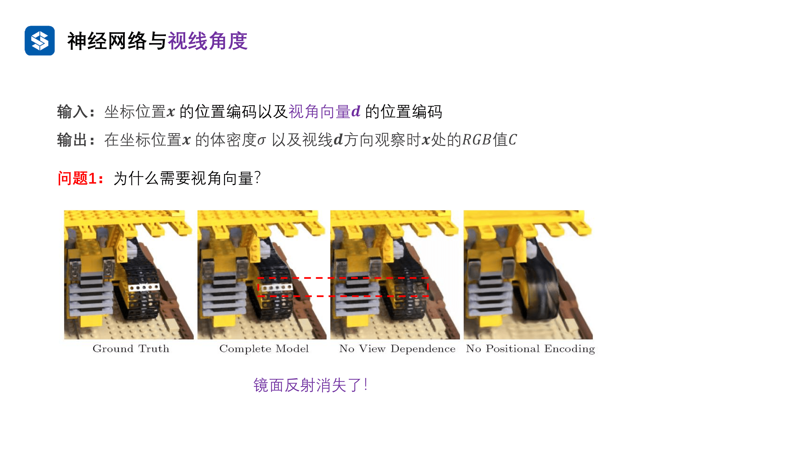

还有就是位置编码也是很重要的信息，首先是如下图中的第四幅图，没有位置编码的情况，可以看到，图像中的高频几何和纹理细节丢失了，也就是神经网络没有学到这些信息，体现在图像上就是纹理丰富的地方看起来是模糊的，图像变化剧烈的地方就会有一种虚化的感觉

不过对于位置编码、图像信号和三维场景三种方面来说，高频和低频代表的含义是不一样的，对图像来说就是低频就是图像的纹理细节，对三维场景来说低频就代表体密度的剧烈变化

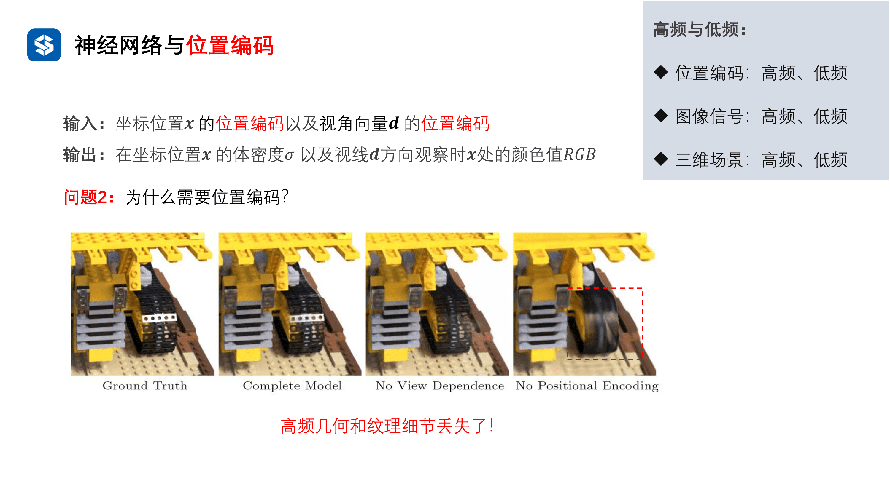

为什么会产生这种问题呢？首先我们假设物体上有两个空间上接近的点 $A$ 和 $B$，当其投影到图像上产生的颜色分别是 $C_A$ 和 $C_B$，一般来说，这两个点的位置差异不大的情况下，投影得到的颜色差异也不会很大，这样就导致在某些高频信息或者变化较大的地方会产生信息丢失的情况，如下图最右侧的图像，变化被模糊了或者说平滑了，高频信息变成了低频信息，所以就必须使得神经网络学会去放大这种信息，也就是要同时具备学习低频和高频信息的能力，而传统神经网络只能学习到低频信息，这就需要位置编码来辅助

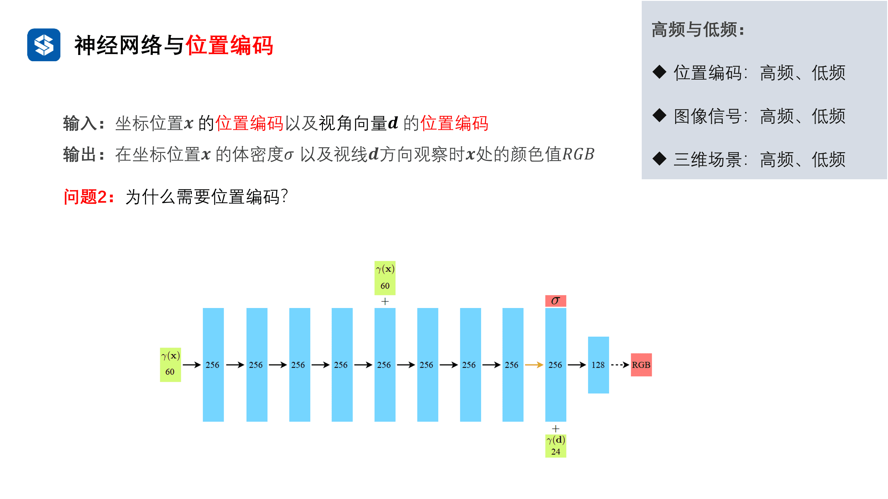

对点的三维位置进行编码，比如说把 $A$ 和 $B$ 的位置向量编码成为十维向量，而且越往前的维度，两个点的差异越小，越后面的维度，两个点的差异越大，这就相当于使用放大镜放大了两个位置之间的差异，而且编码向量中不同维度的差异是不一样的，然后把这种编码输入到神经网络中，神经网络就可以学习到位置上的差异从而学习到高频信息

那么具体是如何进行编码的呢，如下图所示，采用了一种正余弦编码，并且越后面的维度实际上基础频率是越高的，也就是微小的变化都会导致巨大的变化

如下图所示，当空间位置稍有变化的时候，低频信息（灰色图像最左侧的信号）变化不大，但是高频信息（右侧信号）变化剧烈

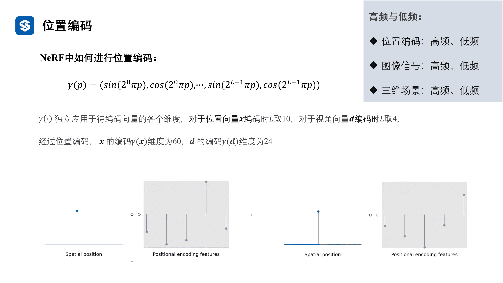

然后编码完成之后，就将位置编码输入到网络中进行训练即可

## 损失函数与训练策略

理论上训练是很简单的，前向推理（合成图像）-反向传播（评估损失然后回传），但是实际上并不是这样容易，因为有一些点的颜色值和 $\sigma$ 值是否更新是不重要的，比如说空气中的点，如果去更新这些点可能会导致问题，所以只需要去更新那些需要更新的点就可以，也就是不考虑那些射线上对最终颜色没有贡献的点，而是去考虑那些没有遮挡的、$\sigma$ 值不为零的点 

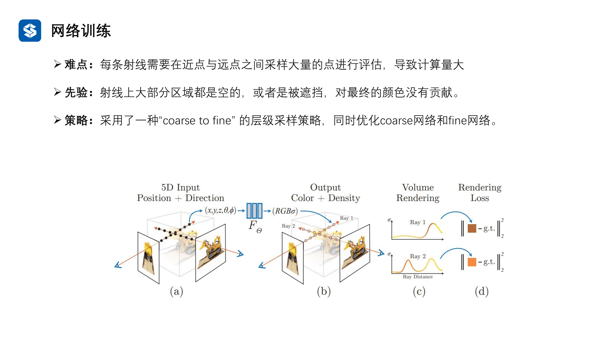

那么这种操作如何完成呢？首先采样 $N_C$ 个点，然后进行一种类似softmax的操作，考虑其色彩权重，这样就得到了一些权重大的点，这样就会着重考虑这些点，然后对这些重要的位置进行重新采样（更为密集），然后把两次采样的结果统一送入网络进行训练，然后当反向传播的时候就会着重更新这些重要的点的参数，这样网络就可以学会采样重要的点进行生成

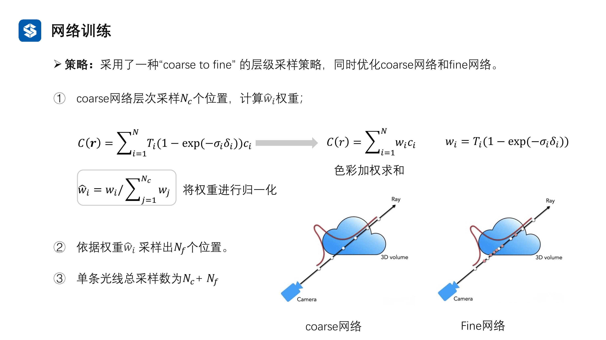

这样就可以学习的更为高效

## NeRF代码（PyTorch重制版）

### NeRF Synthetic 数据集

>数据集组成

- camera_angle_x: 水平视场角
- frames: 每一帧的照片
  - file_path: 每一帧照片
  - rotation: 没有用到
  - transform_matrix: 变换矩阵；$Camera$ 坐标系到 $World$ 坐标系的转换矩阵；$Camera$ 在世界坐标系下的位姿
    - $R$: 旋转矩阵
    - $t$: 平移向量，坐标系的中心（origin）

>坐标系

- 相机坐标系: [right, up, backward] 即 [x, y, z]，右方向是x正方向，上是y的正方向，后方向是z的正方向
- COLMAP: [right, down, forward] 即 [x, -y, -z]

但是在实际使用的时候，还是要对图片进行一些特殊处理的，比如说图像实际上是分为透明区域和非透明区域的，如下图所示，挖掘机以外的部分实际上是透明的，这部分如果要进行处理就会造成资源浪费，甚至会造成收敛困难，所以要进行预处理

可以使用`imageio`包来读取图像序列，然后构成列表，同时也要加载变换矩阵、视场角等数据

### NeRF模型结构

>NeRF 有两个模型：corse、fine，分别是粗采样和精采样的部分

- corse

  - 输入: rays, view_dirs
  - 输出: $\sigma$, $RGB_{corse}$
- fine

  - 输入: $\sigma$、$RGB_{corse}$
  - 输出: $RGB_{fine}$

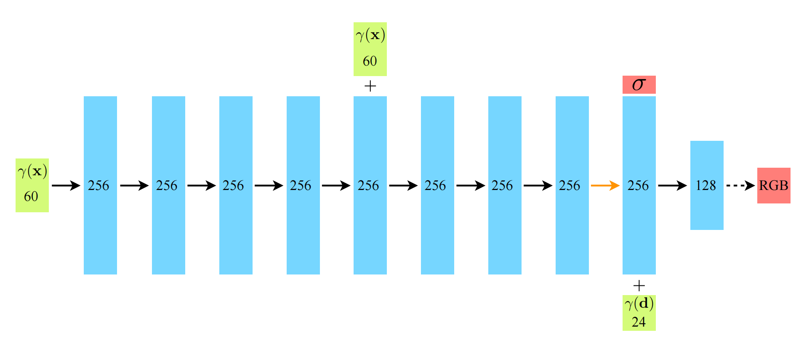

实际上NeRF的网络清一色为线性层和激活函数的组合

  - 第 1 层：(60 + 3, 256)
  - 第 2-8 层：(256, 256)，其中第 5-6 层为：256 -> 256+cat -> 256
  - 第 9 层：(256, 256)
    - 分支 1: (256, 1)，输出 $\sigma$
    - 分支 2: 加入了归一化坐标系的特征，(256+cat, 128)
  - 最后一层：(128, 3)，输出 $RGB$

# 4 NeRF 的相关概念

>神经辐射场（Neural Radiance Fields）

- 辐射场可以把它看做是一个函数：
  $$f: (x, y, z, \phi, \theta) \rightarrow(R, G, B, \sigma)$$
  - 输入：
    - $(x, y, z)$: 目标点的三维坐标
    - $(\phi, \theta)$: 射线的方向
  - 输出：
    - $(R, G, B)$: 像素颜色
    - $\sigma$: 密度，相当于是权重，用来加权求和得到最终的颜色

- NeRF 就是用神经网络来构建这个映射

&emsp;

>体素渲染（Volume Rendering）

- 射线由相机坐标系原点 $O$ 和像素的坐标 $(x, y, z)$ 连成，对这条射线上所有的点的颜色做某种运算就可以得到这个像素的颜色值：

  - 连续：积分，公式见论文
  - 离散：加权求和，公式见论文

  当每个像素的颜色都计算出来，那么这个视角下的图像就被渲染出来了

&emsp;

>分层采样（Hierarchical volume sampling）

- 然而又有一个问题，我们希望这个辐射场是连续的，但是空间是无限的，怎么计算？
- 所以提出了分层采样
  - 第 1 次采样
    - 用于 coarse 模型
    - 在一条光线上采样 $n$ 个点进行 coarse 模型训练
    - 输出 $RGB$、$\sigma$
  - 第 2 次采样
    - 用于 fine 模型
    - 利用 coarse 模型输出的 $\sigma$ 计算重采样的权重，对射线进行2次采样
    - 输出最终的 $RGB$ 值

# Mip-NeRF

这是NeRF一个经典工作，创新点是对NeRF在成像质量上进行了改进

## 混叠与抗混叠

混叠现象的发生实际上就是采样频率不满足奈奎斯特准则，导致高频信号被采样成低频信号，最终导致频谱发生了混叠现象

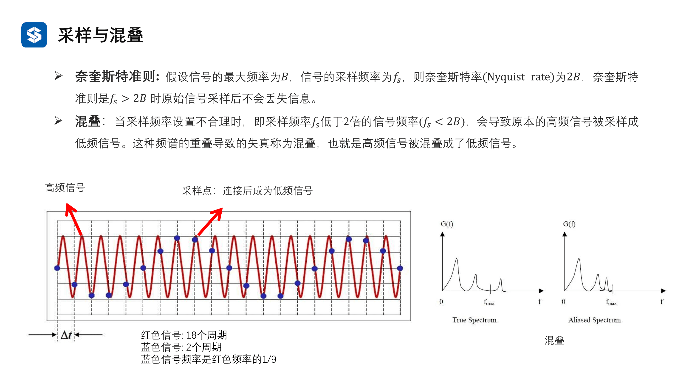

而抗混叠的方法主要是有两种，一种是增加采样频率，使其满足奈奎斯特采样频率，这样就可以从根本上解决混叠情况，但是这种会导致计算量的增加，另一种方法就是使用低通滤波器，根据采样频率去除信号中高于采样频率一半的频率分量，从而避免混叠

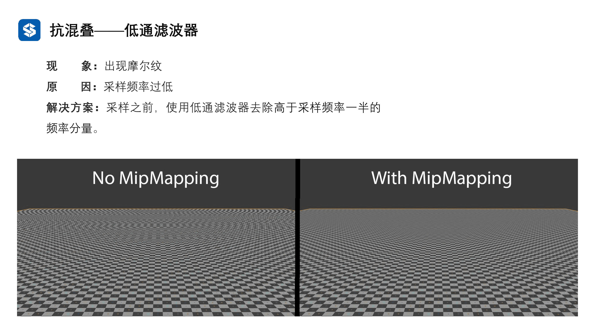

如上图所示，当采样频率过低的情况下，远处的格子图像区域就会出现摩尔纹现象，而使用了低通滤波器之后，如右边的效果图所示，远处格子区域图像的确看不到摩尔纹了

低通滤波器常用的有高斯滤波器，高斯滤波器通过对每个像素周围的像素进行加权平均，实现平滑效果。较大范围的平滑会导致更多的细节丢失，但能更有效地减少噪声。

具体来说，高斯滤波器是通过一个卷积核来实现的，这个卷积核实际上是通过一个正态分布采样得到的，如果方差越小，那么“我自己”所占权重越大，如果方差越大，那么周围点的权重越大，就可以实现平滑效果，然后对图像中的每个区域进行加权求和得到最终的滤波后图像

其中，$\sigma$ 值需要设置好，否则也会对有效信号造成影响

但是这种方法在实时计算的时候也有一些缺陷，当相机移动的时候，如果对每帧图像进行滤波然后进行采样，会导致实时性非常差，所以就使用一种预过滤的方法，也就是先存起来已经平滑采样之后的，然后到真实使用的时候，就从分辨率接近的图像中做一些调整和采样

这是图形学中常用的一种方法，当相机一点点移动的时候，就是一点点从高分辨率图像采样，把一个大图通过平滑采样生成一个小图像

## NeRF的混叠问题

在原始NeRF中，当摄像机远离物体运动的时候，渲染结果就容易导致混叠情况，如上图所示，当分辨率不同的情况下，渲染结果效果也会有很大不同，当分辨率较低的情况下，NeRF的渲染结果并不是很好，如上图 (a) 所示，在满分辨率的近处，SSIM是0.954，但是在远处只有八分之一分辨率的情况下0.751

如果讲近距离和远距离拍摄的照片一起训练，结果就是在近处的渲染效果会下降，远处的渲染效果提高，也就是更为均匀，但是并没有解决这个问题

这种情况出现的原因是NeRF渲染的原理导致的，NeRF的神经辐射场是视线渲染，也就是当相机拉远之后，同一个点上神经网络渲染出的颜色值是相同的，因为射线或者说光路上还是那些点

如果超采样方法，的确可以解决混叠问题，但是如果使用多条射线进行采样，那么会严重拖慢效率，是很不实用的方法

所以Mip-NeRF提出的改进就是使用视锥去渲染，这样在不同距离的情况下，视线中的点就会有所不同

实际上Mip-NeRF就是使用了一个低通滤波器进行渲染，如上图所示，NeRF是对一个光线上的点进行渲染，而Mip-NeRF是通过视锥或者说圆锥体进行渲染，所以NeRF的一个射线对应一个Mip-NeRF的视锥，一个采样点对应一个视锥截面，然后无法直接对视锥界面进行体渲染（不能采用射线超采样方法），所以要对界面中的采样点进行加权平均，这就相当于把所有的点进行了考虑然后加入了抗混叠方式

所以操作就是如何计算视锥台然后得到最终的图像

## 圆锥台近似计算

第一个事情就是判断位置点 $x$ 是不是在某一个圆台中，如下图第一个公式所示，先计算在射线方向上点与相机点 $o$ 位置的距离是否在一个区间上（也就是查看点是否在圆台对应的深度上），然后查看点与点 $o$ 的连线是否在椎体内部（对比夹角角度）

然后位置编码的期望值是集成位置编码的和除以所有点的个数，然后就可以得到了均值，当然这只是理论上的公式，在实际应用的时候这个公式是非常复杂的，甚至无法计算，所以需要另辟蹊径

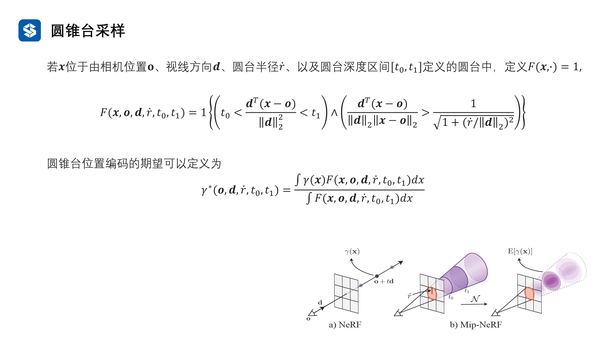

在实际应用的时候，是使用一个三维高斯球去逼近这个圆台的，让这个高斯球中的元素个数尽可能逼近这个圆台中的元素个数，那么这个高斯球的参数需要满足什么要求才可以逼近圆台呢？

下图中的公式给出了高斯球的参数计算方法，具体的证明推导需要查看原论文，这样高斯球就可以尽可能占满空间，尽可能多的保留空间中的信息

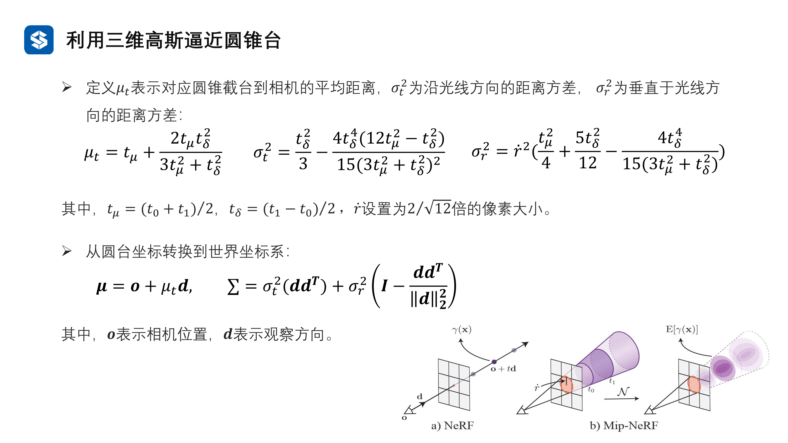

而要计算高斯球中所有点的期望值是很容易的，高斯的期望就是其均值，然后计算位置向量 $x$ 经过 $\gamma$ 变换之后的期望，然后高斯球的均值和协方差矩阵计算方式如上图所示，实际上这些参数都是根据这些圆锥台的情况计算出来的，以便于高斯球尽可能逼近圆锥台

## 集成位置编码

实际上就是把NeRF的位置编码写成矩阵的形式，当然顺序上可能有所不同，在这里是正弦和余弦分开放置，但是并不影响，因为神经网络对位置实际上并不敏感，只需要保证在同一个网络中位置编码方式一致即可

然后就可以根据概率理论计算出来位置编码的数学期望，这里注意一下，实际上位置编码中每个维度都是相互独立的，所以只需要计算出来每个维度的期望即可

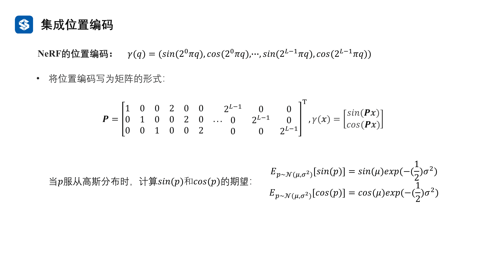

然后就可以进行期望的计算了，计算公式如下，然后就可以得到集成位置编码信息，也就是三维高斯球中每个点的位置编码的期望值

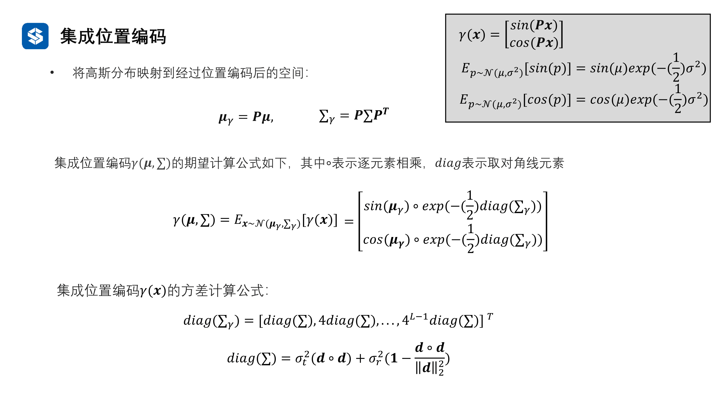

## Mip-NeRF与NeRF的对比

第一个区别就是编码方式，Mip-NeRF使用了集成位置编码，如下图所示，越近，高频位置越有值，越远，高频位置越为零，也就是越靠近相机，台越小，高频信息越重要，越远，平均的范围越大，高频信息越不重要，而NeRF是不论远近，高频位置都是有值的

然后就是采样差异，NeRF是基于光线采样，那么不论远近，一个光线上的点投影结果是一致的，而Mip-NeRF是通过视锥方式进行投影，就可以对不同远近的点进行不同的采样

在采样方式上，NeRF是通过粗细网络分别进行学习如何采样，粗网络是均匀采样然后得到体密度分布，然后通过细网络去在体密度大的地方多采样（细节上），但是在Mip-NeRF中就不需要这样了，因为台的存在已经可以实现了一套网络完成采样和学习

# Instant-NGP

对NeRF进行了速度上的改进，主要是依靠哈希表等结构进行改进

## 哈希表

先考虑一个查询的操作，比如说去查询资料，通过名字找到对应的资料文件夹，然后把其中的资料拿出来，实际上就是一个检索的过程，也就是根据键去计算出来桶的索引，然后去相应的桶中去查找值，哈希函数的作用就是把“名字”映射为值

实际上哈希表提供了非常快速的数据访问速度，这种操作可以用于NeRF中，加快成像速度

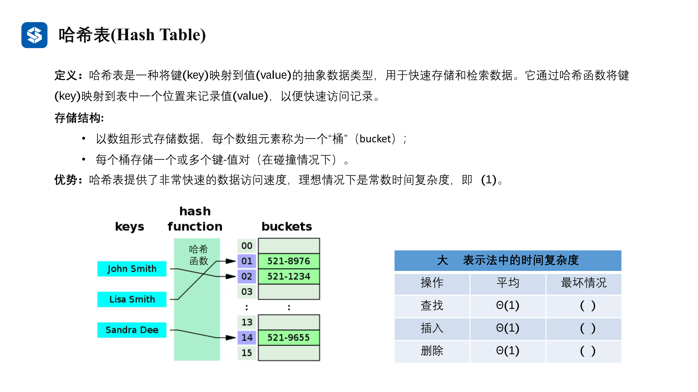

## 球谐函数

Instant-NGP使用球谐函数来替代方向编码，因为这也是一个非学习的部分，所以可以单独使用和替换

这是一种基于球谐波函数来表示颜色光照的方法，采用了一组线性基来表示不同的颜色，基的数量越多，表示能力就越强，但是计算量也越大

本质上是一个有损压缩。有点像个密码本，你一本我一本，上面写了基函数的定义，这样传密码的时候只要传几个系数就可以了，系数传到我这儿，我能复原出y = f(x)，只是没那么准确了。

这里阶和次代表什么含义，这里不需要关注，拿来使用即可

那么球谐函数有什么用处呢？在这里主要是用于对视线方向进行编码，把 $\theta$ 和 $\phi$ 带入就可以得到对应的系数

这样的好处是即使神经网络不去学习，颜色和系数之间也是有关系的，这是在图形学理论上就有关系的，更有助于网络去学习颜色，而NeRF中的 $\gamma$ 位置编码函数中，生成的向量和颜色之间是没有显式的联系的，因为视线是与最后生成的图像的颜色是相关的

## NeRF问题及解决思路

Instant-NGP认为，NeRF慢的原因是位置编码方式存在问题，NeRF引入位置编码的原因是为了使得网络具备同时学习高低频信号的能力

但是这种编码方式的问题就是，网络需要自适应选择位置编码中某几维数据来生成体密度与颜色值，这需要在前若干层进行学习，导致网络规模过大，计算效率低。

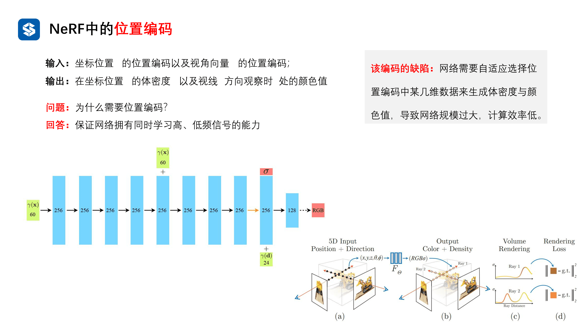

如果在神经网络需要某种信息的时候，就给神经网络什么信息，那么是否可以大大简化神经网络的规模从而提高效率呢？这也就是Instant-NGP的解决思路，其pipline如下图所示。

下图右上角是NeRF的pipline，在渲染的时候会把视线上每个点拿出来进行编码和送入神经网络，然后进行体渲染获取不同点的颜色值，Instant-NGP的流程与此基本一致，只不过其认为位置编码是很低效的，其中很多维度是无用的，需要神经网络自适应去选择维度，所以Instant-NGP就使用了球谐函数来视线方向编码，使用另一种方式进行视线编码

如果从上图中的（1）图中采样两个位置接近的两个点，如果两个点的体密度差异不大（都来自于平坦区域），那么就希望位置编码向量相差不大，如果两个点的体密度差异很大（比如说一个来自于兔子耳朵，一个来自于背景），那么尽管位置差异不大，但是仍然希望编码向量有较大差异，这样就可以使用更小的网络去完成渲染

在具体实现上，则是通过一种更新的位置编码去实现，可以根据不同的体密度进行编码，如果是平坦区域，则编码类似于NeRF中位置编码的前三维，如果是高频区域，则类似后三维，而这个编码则是在Instant-NGP里面预先计算好并且存储的

可以从二维图像上去理解这种编码存储方式，如上图（1）所示，将图像划分为3x3网格，然后存储16个顶点的位置码，当采样一个新的位置点的时候，就可以通过线性插值方式，从其所在网格的顶点的位置码，去计算出来此点的位置码，这是一种通过对空间进行划分的编码方式

但是在三维中这样计算效率是不太高的，所以就引入了哈希表来查找三维点的位置码，对三维中的顶点进行编码，然后使用哈希进行存储和查询

此外，固定分辨率是有所不足的，每个网格实际上就是描述此区域的信息，但是如果一个网格中有大量低频和少量高频信息，那么四个顶点倾向于学习低频信息或者说粗糙表达，编码值也会更为接近，如果使用更高的分辨率，一个网格就会更小，也更容易学习到高频信息编码或者说细节表达，所以在实际应用中会使用多分辨率的网格，一种划分方法就是一种分辨率，一个点会计算多种分辨率下的位置码，然后多分辨率的编码进行拼接，便于同时融入高频和低频信息，至于编码维度实际上只需要可以表达此处频率信息即可，Instant-NGP使用二维的位置编码

而位置编码的获取，实际上是通过训练得到的，训练方式在下节

## NGP网络结构

网络结构如下，首先是分别对采样点位置和视线方向进行编码，视线方向使用球谐函数进行编码得到16维特征，采样点位置使用多分辨率哈希编码，其中分辨率个数有 $L$ 个（论文中的16个），每个分辨率下的位置编码是2维，最终得到了32维的位置编码

然后位置编码通过一个小MLP模块预测体密度，然后体密度会进入另一个MLP模块和视线编码去预测颜色，然后经过体渲染得到了最终结果，这里MLP的网络规模变小了很多，大大加快了速度

位置编码的训练方式是端到端的，初始情况下，顶点位置编码都是随机的，然后通过线性加权得到不同点的位置编码，然后通过MLP网络得到体密度和颜色，在体渲染之后得到最终输出，然后使用损失函数进行反向传播，最终实现顶点位置编码的更新，这个过程是直接融入到整个网络的训练过程中

## 多分辨率哈希编码

这是Instant-NGP的核心创新点，也是最难的地方

首先就是划分为 $L$ 个分辨率，然后计算每种的具体分辨率

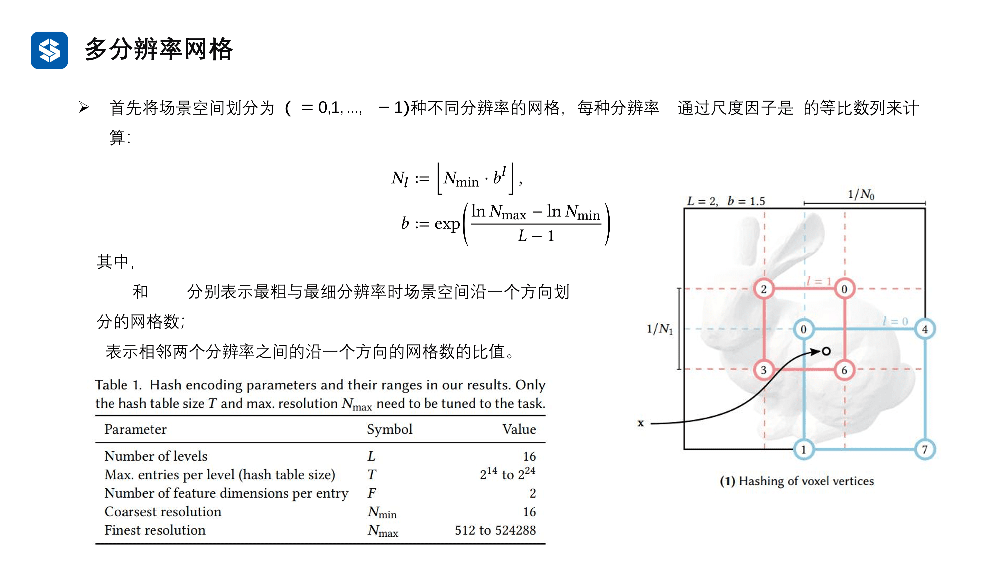

在划分了具体的网格之后，就可以进行特征提取了，首先就是根据采样点的位置获取相应的网格顶点，也就是下图的算法1，但是问题是顶点的坐标不一定是整数，所以不容易进行哈希，故引入第二套坐标系统

比如说上图中的左上角红色顶点，其在整个3x3网格中，从左侧看是第二列，也就是第1个顶点（从0开始计算），从顶部开始看是第二行，也就是其索引坐标是 $(1,1)$，这是一种基于索引的坐标，可以实现整数坐标

下图是以3x3网格为例进行计算的，输入是采样点坐标、采样点所在网格的边界和分辨率（网格数量），其中边界就是两个顶点（大方格的左下角和右上角）所夹的方形区域

算法步骤如下：

1. 计算场景的边界范围，从输入边界中计算出来整个区域的左下角和右上角的坐标，左下角是 min ，右上角是 max
2. 判断采样点是不是在这个边界范围内，如果不在，就将其拉入这个范围
3. 计算网格大小，宽度和高度信息
4. 计算采样点所在网格坐标和网格左下的索引值（就是坐标求差，然后差除以网格大小然后向下求整），计算出来索引值之后就可以计算其他三个顶点的索引坐标还有采样点所在网格的世界坐标（相对整个区域的左下角）

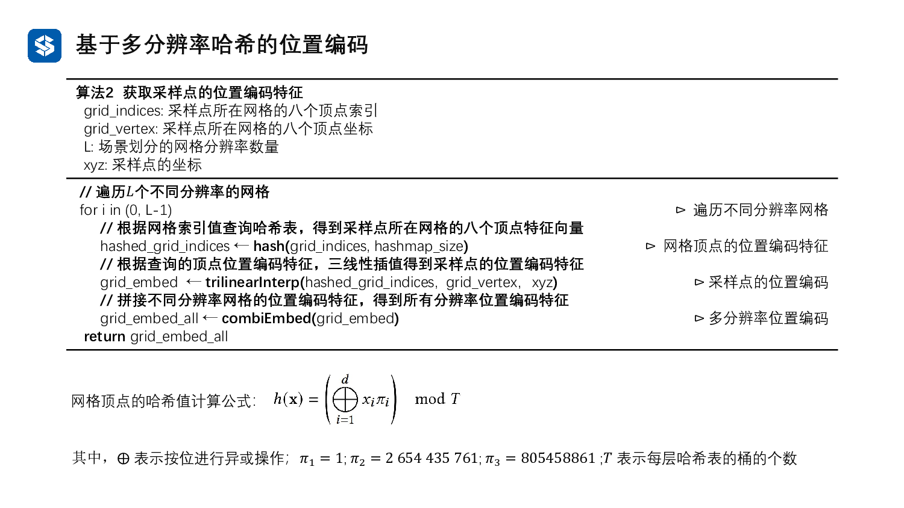

然后就可以遍历所有的分辨率情况，在每个分辨率网络中，得到网格索引值之后进行哈希表查值，得到采样点所在网格的顶点的特征向量，然后进行三线性插值