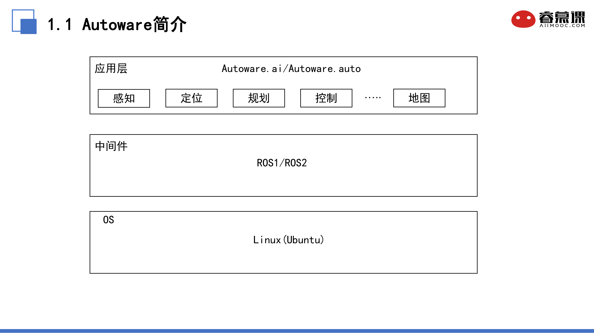

# Autoware介绍

Autoware是世界上第一款开源自动驾驶框架。是在名古屋大学加藤伸平教授(Prof. Shinpei Kato) 的领导下于2015年发布的。如今主要分为两个大版本:基于ROS 1的AutoWare.ai和基于ROS 2的AutoWare.auto。能够广泛的应用于多种车辆的自动驾驶商业部署。

其框架如图

从各种传感器的信号输入到车辆的输出，中间都是由Autoware框架组织起来的

实际上Autoware的定位就是在应用层上做软件算法，基于ros，实际上很多公司在实际开发中不会使用ros做中间层，甚至不会使用ubuntu做OS，但是这些公司自己开发的中间件或者OS也是基于ROS和Ubuntu修改的

# 代码Overview

Autoware是基于ROS的代码库，所以代码架构与ROS类似

在课程代码中，工作空间下有src、install、build、log、relative_files五个文件夹

- src：源代码，也是最核心的，在其中进行最原始的开发，也包括一些启动文件
- log：日志文件夹，存放各种日志
- install：包括了很多从源码编译过来的文件和配置文件，便于在工程部署时一键部署
- build：编译过程的中间文件
- relative_files：不重要的相关文件

## src介绍

在课程的src中，autoware文件夹是源代码

drivers和vendor是实际上车需要的，我们不需要太关注

car_demo和citysim是仿真所需，有很多模型

在src/autoware文件夹下，也有一些文件夹

- common：通用功能
- core_perception：感知定位相关
- core_planning：规控相关
- docementation：一些文件，比如说autoware_quickly_start
- messages：消息接口
- simulation：仿真相关
- ulilities：和common类似，通用工具
- visualization：可视化相关

在上面这些文件夹下的每一个文件夹都是一个ros package，拿core_perception/gnss_localizer来说

在CMakeLists.txt中，有install语句，用于定义安装规则，即指定当运行 `make install`（或其等价的构建命令）时，应如何将项目的文件（比如可执行文件、库文件、头文件等）复制到系统的指定位置。这对于确保软件包的正确部署至关重要