# 三维视觉概述

前面我们我们讨论了视觉中的不同任务，包括语义分割，目标检测，实例分割等等，我们还讨论了关键点估计的一些话题，这些算法在实际生活中有非常多的应用，当然，这些算法都是基于二维图像的

但是，我们的世界不是二维的，而是三维的，这是一个完全独立的研究领域，研究如何增加空间维度到我们的神经网络模型，所以今天的内容就是如何将三维信息传递到神经网络模型中

## 两类问题

我们这里要关注两类问题

第一个就是从单个图像预测三维形状的任务（如下图所示），我们输入一些彩色图像，然后输出该图像中对象的三维形状的表示

第二个就是形状预测的任务，输入一些三维形状数据，然后进行预测，比如说分类或者分割任务

这些任务都是基于监督学习的，所以我们有一个带有输入图像和对象三维形状的训练集（或者三维形状和对应标签的）

## 三维视觉中的更多主题

三维视觉的内容不仅仅是完成分类分割，实际上还有更多的相关主题（很多主题并不是基于深度学习方法的），这是因为三维视觉会涉及对象和世界的三维结构

我们可能有这样一直想法，就是我们想输入一个视频序列，这是一个二维图像帧序列，然后我们想通过视频，预测或者重建摄像机穿过三维世界的轨迹

但是在这里我们只涉及两部分，一个是有监督形状预测，一个是有监督形状分类

# 三维形状表示（3D Shape Representations）

首先，我们应该如何去表述三维形状呢？我们这里有五种表示方式，可以用来模拟三维形状和信息，这也是人们常用的类型，有不同的优缺点，每一种都可以用神经网络模型去预测和处理

下图中展示了五种表达方式，每一种都是相同底层三维形状的不同表示

## 深度图（Depth Map）

### 概念

深度图在概念上是一个非常简单的三维形状表示，深度图的作用是对于输入图像中的每个像素，分配从相机到该像素的距离，因为图像中的每个像素都对应于现实世界中的某个对象，现在深度图告诉我们，对于图像中的每个像素，相机与该像素试图表示的现实世界中的那个位置之间的距离是多少，单位是米。

不过深度图比以往的RGB图要多一个网格，其中每个像素值给了我们一个深度信息，有些类似于RGB图像的二维网格，只不过像素的值不是颜色，而是“深度”，以米为单位的深度，然后将其与RGB图像结合，深度作为第四个信息通道，提供深度信息

或者我们可以叫他为2.5D图像或者RGB-D图像，因为深度图不像一个真正的完整三维表示，因为它的缺点是不能正确捕捉被遮挡物体的结构，比如说上图中，书柜的一部分被沙发遮挡了，那么相应的深度图就没有沙发后面书柜的任何三维表示，所以说RGB-D只能表示图像的可见部分，出于这个原因，我们可能认为它是一种不是很强大或者不是很通用的三维表示

但是这种深度图类型的数据是很重要的，因为我们可以使用各种原始3D传感器去捕获深度图数据，比如说结构光相机

### 深度预测

不过我们可以想尝试一个任务，就是输入一个普通RGB图像，然后尝试逐像素地预测相机到对应物体的距离（如下图所示），使用全卷积网络完成这个深度预测任务

但是实际上这是不太可行的，因为在三维视觉中，会有**尺度/深度歧义（Scale / Depth Ambiguity）**的问题，比如说对于一张图片，无法区分出远处大物体和近处小物体，或者说仅通过单张二维图像，我们无法准确地确定物体的实际大小和距离

如下图所示，大猫是小猫的两倍大小，但是与相机的距离也是小猫的两倍，那么看起来是完全一样的大小

也就是说，绝对尺度和绝对深度在单个二维图像中并不明确，所以会产生这种问题，所以在处理任何类型的三维表示或者三维预测问题的时候，考虑这个潜在的问题是很有必要的

但是我们可以通过改变神经网络的结构来处理尺度/深度歧义问题，或者说我们可以通过改进损失函数来完成深度预测问题

因为尺度和深度实际上是不变的，假设我们的网络模型预测了一个深度，达到了Ground Truth Depth的某个恒定比例，那么上图中的尺度不变损失函数仍会将这个情况认定为零损失，或者说，这个尺度不变损失函数只会关心预测深度是不是匹配真实深度的某个固定倍数，这个属性细节叫做比例方差

### 表面法线（Surface Normals）

这是第二种三维形状表示，想法上与RGB-D深度图很接近，只不过在这里，我们给每个像素分配的是一个单位向量（或者说法线）

每个表面点的法线都是垂直于该表面的单位向量。对于平面，法线的方向是确定的，但对于曲面，每个点的法线可能都不同。在计算机图形学和计算机视觉中，表面法线被广泛用于光照计算，以判断物体表面的亮度和颜色。

理解表面法线也对物体识别和场景理解有重要作用。例如，通过分析一幅图像中的表面法线，我们可以推断出物体的形状和结构。在一些深度学习应用中，表面法线也被用作一种重要的特征来帮助模型更好地理解场景。

不过在这里，我们会使用RGB颜色来绘制法线的情况，比如说上图中，蓝紫色表示法向量是向上的，红色表示向前的

当然我们也可以使用一个网络来预测表面法线，我们可以输入RGB图像，然后去预测每个位置的三维向量

然后我们的损失函数是对比两个法向量之间角度的差异，这里我们使用点积除以范数的方式进行归一化，以此来训练网络

或者可以训练一个联合网络，同时完成语义分割、深度估计和表面法线估计

这是一个相对简单的表示，但是在实践中是有用的，因为一旦有了深度图和表面法线，就可以得到很多关于图像三维结构的信息

当然，缺点还是不能表示被遮挡的地方

## 体素网格（Voxel Grid）

### 概念

"Voxel"是"volume"（体积）和"pixel"（像素）的结合词，指的是在三维空间中的像素，也就是体素

体素网格就像是三维的像素网格，它将三维空间划分成了一系列的小立方体（也就是体素），可以使用某些方法看到每个体素是否被占用（比如一个bool值），这有点像我的世界一样。每个体素都可以存储一些信息，例如颜色、密度、表面法线等，有点像Mask R-CNN中物体背景和前景的表示。通过这种方式，我们可以在计算机中表示和处理三维对象。

体素网格在许多领域都有应用，如计算机图形学、医学成像、地质科学和机器人导航等。例如，在计算机图形学中，体素网格可以用于渲染复杂的三维场景；在医学成像中，MRI和CT扫描的结果通常就是体素网格；在机器人导航中，体素网格可以用于表示环境并进行路径规划。

然而，体素网格也有一些缺点，例如它需要大量的存储空间，而且处理速度可能比较慢，尤其是在需要捕捉非常精细的细节的时候，分辨率回非常高，比如说图中的椅子就使用了非常多的像素。因此，在实际应用中，人们经常使用各种优化技术，如八叉树（Octree）和稀疏哈希表（Sparse Hashing），来高效地存储和处理体素网格。

### 处理：三维卷积

如果我们想对这些体素网格进行分类的话，一样可以使用卷积网络的架构，不过我们需要使用一种三维卷积的方式去完成

输入数据是一个原始的体素网格，每个点都有占用或者未占用两种情况，如何我们使用三维卷积核（类似于一个立方体）去滑动来计算内积，有点类似于一个立方体滑动着遍历这个空间的每个地方，然后产生下一层的标量输出，若干次卷积处理之后进入分类层，这在架构上与之前的二维卷积完全一致

当然，这里维度还是稍微有所不同的，每个阶段的张量都是一个四维张量，三个空间维度和一个特征维度（或者通道维度，表示体素是否被占用，这个是二进制的）

### 预测体素：三维卷积

我们下一个想完成的任务就是使用RGB图像去预测三维形状的体素网格

左边输入的是一个RGB图像，两个空间维度和一个RGB通道维度，我们需要预测一个四维张量，带有三个通道维度和一个通道维度，可以通过网格中每个点的占用概率信息，这需要我们设置一些架构，来添加额外的空间维度，然后使用交叉熵损失来训练这个网络

一种常见的完成这个任务的方式就是使用桥接的方式去连接不同维度的张量

首先我们对这个RGB图像使用卷积网络处理得到二维图像的特征图（这是一个三维张量，空间维度加一个特征维度），然后展开成一个特征向量，然后使用一个全连接层将其重塑为四维张量，然后我们就可以使用上采样方式得到三维表示

当然，这种方式的计算成本很大，所以并不适合

### 预测体素：体素管

"Voxel Tubes"是一种从二维图像生成三维体素网格的方法。这个方法基于一个假设，即每个像素的颜色和亮度都对应于一个小的、垂直于图像平面的体素管（Voxel Tube），这些体素管可以被组合在一起，形成一个完整的三维体素网格。这种方法只基于二维卷积，在计算上更有用

首先我们输入一张RGB图像，然后使用二维卷积得到一个CxHxW的特征图，但是在网络的最后一层非常特殊，因为我们想预测体素的输出，那么就要在这里安排空间卷积

不过，在这里实际上使用两个空间维度和一个通道维度，但是在计算损失的时候，我们会解释通道维度为输出张量的深度维度

在卷积的最后一层，就沿着通道维度去预测一个Tube，给我们预测一整管的体素概率

在这个方法中，每个体素管的高度（也就是在深度方向上的大小）可以由图像的亮度决定，而宽度和长度（在图像平面上的大小）可以由像素的大小决定。这样，我们就可以从一个二维图像生成一个粗糙的三维体素网格。

不过问题是，当我们使用三维卷积核去卷积的时候，是牺牲了Z方向的平移不变性的，但是在XY方向上仍然有很好的平移不变性

然而，这个方法有一些限制。首先，它假设图像中的每个像素都对应于一个体素管，这在许多情况下可能并不成立。例如，对于遮挡和反射等现象，这个方法可能无法处理。其次，这个方法生成的体素网格可能比较粗糙，不能精确地表示物体的形状。

为了解决这些问题，我们可以使用深度学习的方法，如卷积神经网络和生成对抗网络（GAN），来改进这个过程。这些方法可以学习从二维图像到三维体素网格的映射关系，生成更精确和细致的体素网格。

### 问题

体素表示的问题就是占用空间很多，比如说我们使用32位浮点数来表示体素，那么一个1020x1024x1024大小的体素，就需要使用4GB的空间

当然也是有解决方法的

### 多分辨率体素：八叉树

这种体素的想法是一个体素网格可以有多重分辨率，这样可以使用一些低分辨率体素去构建主要结构，然后使用高分辨率的体素去构建细节，高分辨率体素可能是低分辨率体素的稀疏子集

### 多分辨率体素：嵌套形状层

这种方法的思想是，与其表示为密集的体素网格，不如表示为完整三维形状，或者说将对象形状从内到外的表示出来

我们有一些粗糙的外层，然后有一些负体素，我们可以稀疏的表示

我们可以将一个物体表示为不同的稀疏体素层的总和

## 隐函数法（Implicit Functions）

这是一种隐式表面的想法：我们想将三维形状表示为一个函数，所以我们需要做的就是学习一些函数，输入一些三维空间坐标，就可以输出任何位置被占据的概率

与体素网格这种方法不同，体素网格这种方法就是在空间中一些有限点集上对这样的函数进行采样，然后将这些样本以某种显式网格表示形式存储到函数中，但是我们在这里使用隐式函数，使用这种数学函数本身来隐式地表示这些三维形状，然后我们可以在3D空间中的任意放置点从这个函数中采样，它应该告诉我们这个位置是在对象内部还是外部

在实践中，通常把对象表示为层次分明的点集，比如说物体表面的占用概率就是0.5，我们可以直观的的显示，如上图所示，蓝色代表非常接近1的值，红色代表非常接近0的值，白色区域是0.5水平聚集的地方，代表三维形状的实际表面，或者可以成为带符合的距离函数

其思想是这种函数给出了三维空间中的点到表面的欧几里得距离，距离的正负决定了点在对象内外

当然这个函数可能会非常的复杂，所以我们会使用神经网络去学习这个函数表示

## 点云（Point Cloud）

### 概念

点云，实际上就是将物体表示为三维空间中的点集（是一组没有顺序的点，顺序不影响点云本身），或者说使用一组点集以某种方式覆盖我们想表示的三维形状的表面，比如说下图中的飞机

与体素网格相比，点云某种程度上更有适应性，如果我们想使用体素网格表示精细的细节，那么分辨率就会很高，但是在点云中，我们可以使用不同的点云密度来改变细节的精细程度

当然，点云也有缺点，如果你想实际提取一些三维形状来可视化，那么基需要某种后处理，因为在数学上，点云中的点是无限小的一个质点，但是在可视化的时候我们必须让每个点变成一个有限大小的球然后进行渲染，才可以在屏幕上可视化显示

但是点云在神经网络中是一个非常有用的东西，同时也是非常常见的，比如说在自动驾驶中，激光雷达就是收集了周围环境的点云表示，所以在自动驾驶程序中，点云是经常使用的，我们可以根据这些原始点云输入去做出一些决策

总的来说，点云是一种很好的表达形式，接近传感器原始数据，同时其表示起来很容易（一个多维向量就可以表示，坐标、颜色、强度等特征），同时可以更好的表示三维形状，在诸多领域都有很好的应用

但是注意一下，点云是一种无序的数据，不同的表示顺序对于点云并没有任何影响，并且点云还有平移/旋转不变性

### 数据集

在点云处理领域，有一些比较常用的数据集

1. ModelNet：每个物体点云由一千个点组成，而且是使用CAD模型直接生成的点云，所以其中是比较规范的没有噪声的点，常用于分类任务
2. ShapeNet：每个物体点云由两千个点组成，常用来做分割任务
3. PartNet：划分更精细，一个物体点云中包括了不同部件的划分，并且相对新，对机器人的抓取等任务更有用

上面的是一些相对独立的物体，下面是一些更偏实际大场景的数据集

4. Stanford 3D indoor scene：有八千个点
5. Semantic 3D：更大的数据集，更密集的点云
6. ScanNet：也是很大，可以做检测和分割
7. KITTI，Apollo，nuScenes，Waymo：偏向于工业实用

### 生成点云输出

我们想做的另一件事就是使用RGB图像去生成三维形状的点云输出，我们同样可以使用神经网络来完成这个操作

### 损失函数

我们总是需要一种损失函数去训练网络，来比较生预测点云和实际标签之间的区别，或者说去比较二者之间的区别，同时需要这个函数是可微的，便于我们反向传播，这个函数就是钝化距离（Chamfer distance）

我们想输入两组点，橙色和蓝色，然后钝角距离就会告诉我们，这两组点有何不同，实际上这个函数有两部分

第一部分，是对每个蓝色点，寻找最近的橙色点，然后我们将计算二者之间的欧氏距离，然后对所有的距离求和

第二项是一样的内容，不过是对橙色点而言的计算

两项最近邻匹配距离项的总和就是钝角函数，唯一使得损失函数为0的方法就是两个点云完全重合

它有几个特性使得它非常适合用于点云神经网络。

1. **无序性**：点云数据本身是无序的，点的顺序并不影响点云表示的实际物体形状。Chamfer distance 计算的是每个点到另一个点集中最近点的距离，这个计算过程与点的顺序无关，这是一种最近邻操作，这意味着，无论我们如何改变点云中点的顺序，Chamfer distance 的值都不会变，这与点云数据的无序性相符合。
2. **鲁棒性**：Chamfer distance 是一个双向的度量，它既考虑了第一个点集中每个点到第二个点集中最近点的距离，也考虑了第二个点集中每个点到第一个点集中最近点的距离。这意味着，如果一个点集中有一些点在另一个点集中没有对应的近邻点，Chamfer distance 也不会变得非常大。这使得它对噪声和离群点有很好的鲁棒性。
3. **简单易计算**：虽然 Chamfer distance 的直接计算需要对每一对点都计算距离，但是我们可以利用空间数据结构（如KD-tree）或者近似算法（如最近邻搜索）来加速计算，使得它在实践中可以高效地用于大规模的点云数据。

## 三角网格（Triangle Mesh）

### 概念

这是计算机图形学中非常常用的表示，有点类似于点云，因为它是将三维形状表示为三维空间中的一组顶点，在三角网格表示中，三维物体的表面被划分为许多小的三角形面片，这些三角形面片的集合就构成了三角网格。

每个三角形面片由三个顶点（vertices）和三条边（edges）组成。顶点存储了空间中的坐标位置信息，可能还会包含其他属性信息，如颜色、法线、纹理坐标等。边连接了两个顶点，描述了三角形的形状。除此之外，三角网格还包括了面（faces），即由三条边围成的区域，它们描述了物体的表面。

三角网格的优点在于它可以准确和高效地表示复杂的三维表面（在计算机图形学中常用）。由于三角形是平面的，任何复杂的三维表面都可以通过足够数量的三角形面片来逼近。此外，三角网格还支持多种几何运算，如交、并、差等。

### 预测三角网格：Pixel2Mesh

当然这也需要一种新网络去处理这种数据，比如说ECCV2018年的一篇新论文，就是一种使用神经网络处理网格的算法，称为Pixel2Mesh，这种网络，输入一个RGB图像，然后输出一个三角网格，给出一个图像中物体的完整三维形状

当然其中有几个关键的地方

### 迭代精细化

第一个地方就是，我们想构建一个神经网络来输出三角网格，但是实际上很难从头创建一个网格对象，所以我们需要将一些初始网格模板输入到网络中，然后随着网络的学习，这个网格开始变形，最终变为我们所需的输出，所以我们需要将初始的球状或者椭圆体网格作为模板在初始阶段输入网络

我们会以某种方式去查看初始网格与图像的匹配度，然后不断的对网格进行更新（或者说迭代精细化），最后就可以输出与输入图像的几何形状非常匹配的三角网格

### 图卷积神经网络

第二个地方就是我们需要一种在网格结构数据上可以操作的神经网络，这是因为网格并不是我们常见的规则化数据，在这里，我们使用的就是一种名为图卷积的运算

我们熟悉二维/三维卷积运算，我们通过卷积运算输出一个新的特征图，特征图中的特征取决于输入数据中某个局部感受野或者特征的局部淋雨，然后我们通过卷积核的不断滑动来计算所有的特征输出

但是，我们现在使用的数据，不是空间网格，而是任意图结构，所以我们这里的操作要进行相应的改变，图卷积层的输入是一个图和一个附加到图的每个顶点的特征向量

我们想计算图卷积层的输出的时候，依然延续感受野的概念，每个顶点的新特征向量和输出特征取决于输入图中特征向量到图卷积层的局部感受野，所以我们需要依赖于一种特色的数学形式来计算，输出特征向量$f^\prime_i$取决于输入特征向量和所有相邻顶点的特征向量

然后我们将这个卷积函数应用与图中的每个顶点，这类似于图像卷积，这样就可以应用与任意数量顶点的图

我们认为这又是一种非常好的处理网格结构数据的方法，并提出了某种神经网络结构

### 对齐

回顾任务，我们想根据一个RGB图像预测三角网格，所以我们需要一些方法将图像信息混合到图卷积网络中，所以我们有了一种对齐的想法

对于网格中每个顶点，我们想从图像中获得某种特征向量，代表图像在该顶点的空间位置上的视觉外观，我们可以完成的是，使用二维卷积网络处理图像来提取特征

如果我们了解相机的内在特性，我们可以使用某种投影算子将我们的三维三角网格的顶点投影到图像平面上，对于每个顶点投影位置，我们使用双线性插值来从卷积网络输出的特征中进行采样，这样就可以使得每个顶点的特征向量完全对齐到图像平面中该特征的位置，这与我们之前在Mask R-CNN中的RoI对齐运算符的想法是一致的

但是我们仍然想对特征向量和二维图像平面中的任意位置进行采样，而不是像RoI对齐哪有在规则网格中进行采样，我们现在要做的是在图像平面的每一点上对所有投影顶点位置的特征向量进行采样，这样才可以将图像信息混合到我们的图形卷积网络中

### 损失函数

最后一件事就是损失函数，但是，同一个形状有多重不同的表示，比如说下图中的一个正方形，可以使用两个或者四个三角形来表示，我们希望我们的损失函数不受我们用三角形表示形状的特定方式的影响，而是取决于基础形状本身，不是取决于表示方式

我们实际上是有方法的，就是沿着网格内部取样，将其转化为点云（如下图所示），然后使用钝化距离来比较两个点云之间的区别

当然这里区分一下在线采样和离线采样的区别，在线采样是对预测的网格采样，离线采样是对标签网格采样

当然，我们需要通过左边的采样操作进行反向传播，这又是一个复杂问题

# 形状比较指标

## 概念

我们也需要一些指标，来对比模型效果，便于查看模型是否训练良好，在二维目标检测中，我们会使用交并比来查看，在三维中，我们一样也可以使用类似的方法

当然，在三维中，交并比可能并没有那么大的意义，所以我们可以使用钝化距离来比较我们的精度，这是因为钝化距离使用了L2距离，对异常值很敏感，很适合用来完成评价

## F1分数

F1分数（F1 Score）是一种用于评估分类模型性能的统计指标，尤其在数据不平衡的情况下特别有用。它是精确率（Precision）和召回率（Recall）的调和平均值。

F1分数在点云上进行评估，有点类似于钝化距离，我们有两组点云（下图中橙色蓝色的两组），橙色为预测点云，蓝色为真实点云，如果预测点云在某个阈值半径内，那么就被认为是正确的

我们想象一下，每个预测点云周围扩展出一个球体，如果一些真实点云落在李沐，那么这个预测点云基被认为是真实的，在下图例子里面，四个橙色点云中三个是正确的，所以精度是3/4，三个真实点云只有两个被预测正确，那么召回率就是2/3，进行一个几何平均值处理就是F1分数

- 精确率：在所有预测为正例的样本中，真正为正例的比例。
- 召回率：在所有真正为正例的样本中，被正确预测为正例的比例。

F1分数的公式为：

F1 = 2 * (精确率 * 召回率) / (精确率 + 召回率)

F1分数的值范围在0到1之间。1表示模型的表现最佳，0表示模型的表现最差。由于F1分数同时考虑了精确率和召回率，因此它能够更全面地评估模型的性能，并且对异常值更稳健，尤其在正负样本不平衡的情况下。

然而，F1分数并非在所有情况下都是最佳的评估指标。如果你更关心精确率或召回率，可能需要直接使用这两个指标，或者使用其他权衡两者的方法，如ROC曲线下的面积（AUC-ROC）。

# 常用3D传感器

3D常用的传感器可分为两类，**被动传感器 (Passive Sensors)**和**主动传感器 (Active Sensors)**，主动和被动的区别是主动传感器可以自主发射信号去探测环境，如激光雷达等

3D传感器生成的3D数据，可以提供更丰富的几何、形状和尺寸信息，相比于2D数据，便于计算机更好的去理解环境

## 相机

被动传感器中单目相机具有信息丰富的颜色和纹理属性、更好的路标文本视觉识别、高帧速率和可忽略不计的成本等优点，然而，它缺乏深度信息，这对于准确的位置估计至关重要。为了克服这一点，立体相机使用匹配算法来对齐左右图像中的对应关系以进行深度恢复。

## 激光雷达

主动传感器中激光雷达是一种具有透镜、激光和探测器三个基本组件的点对点发射设备，发出的光脉冲将以三维点的形式从周围环境中反射回来，形成“点云“。高稀疏性和不规则性以及缺乏纹理属性是点云的主要特征，它与图像阵列有很好的区别，激光雷达的另一个问题是部署成本高。

## 相机系统

我们想输入一张图片，然后输出一个三维形状来表示，那么我们必须使用一个坐标系，或者说我们必须使用一个**标准坐标（canonical coordinate）**，这意味着我们对每个对象类别的对象进行排序的时候，某种程度上就固定了标准方向，比如说下图中的椅子，可能Z轴正方向就是座椅前方

另一种选择是在**视图坐标系（View Coordinates）**下进行预测，这会使得三维坐标系与输入图像对齐，是表示三维形状坐标系的另一个选择，很多人认为这是一种更容易的坐标系

标准坐标系有一个问题，那就是输出特征和输入特征不再对其，视图坐标系的话，在特征位置上，输出总是与输入相对应的，出于这一点，如果相同的网络，使用不同的坐标，那么标准网络更容易过拟合，视图网络泛化性能更好

# 数据集

ImageNet如此成功，以至于人们创建一个数据集就想为其起名字，这也就是ShapeNet这么命名的原因，并且随着三维视觉的发展，三维数据集也逐渐建立

目前，三维形状分类的数据集有两种，合成数据集（Synthetic Dataset）和真实数据集（Real-world Dataset），前者中的物体是完整的，但是没有任何遮挡和背景，真实数据集中的物体有不同程度的遮挡，并且存在背景噪声

对于目标检测与跟踪来说，有室内数据集（Indoor Scenes）和室外城市场景（Outdoor Urban Scenes）

ShapeNet是一个三维模型数据集，提供了五十个类别的五万个模型

但是，这个数据集是合成的，只有孤立的物体，没有上下文信息，所以需要其他的数据集，也就是Pix3D

它有家具的三维模型，或者说这是真实世界的图像，有更多的上下文信息，但是太小了

# 三维预测：Mesh R-CNN

这是R-CNN的三维版本，输入一个真实世界的RGB图像，然后为每个检测到的图像发出一个完整的三角网格，提供每个对象的三维形状

Mesh R-CNN还是有很多优点的，比如说可以做出各种输出

## 方法改进：新的迭代精细化

但是，网格变形的方法限制了可输出的三维形状的拓扑结构，这是因为输出必须有这与初始网格相同的拓扑结构，如果拓扑结构不同，比如说球体就无法变形为甜甜圈，这也是迭代精细化方法的一个局限性，这也是需要克服的

克服的方法，就是首先进行粗糙的体素预测，然后将其转换为三角网格，得到这个网格之后继续迭代精细化操作，下图就展示了我们这个操作，对一个输入的RGB图像，首先进行二维目标检测，然后进行三维物体的体素重建，然后转化为三角网格进行迭代精细化，这样就可以输出有任意拓扑结构的网格了

此外还有一些示例，都可以看到，效果还是十分精细的

## 正则化方式

当然，这里还有一个小问题，然后我们只使用钝化距离作为损失函数进行训练，可能得到非常难以理解的结构，所以我们需要使用一些正则化方法来实现视觉上更符合人类审美的输出

除了钝化距离以为，我们还最小化了网格中每条边的L2范数

可以看到，模型可以输出细粒度更好的形状

当然，我们知道这个模型是建立在一个目标检测框架上的，所以可以检测非常多的对象，甚至可以预测对象的不可见部分，比如说下图中被狗头遮挡的沙发

当然这个也有不足，就是如果二维视觉中失败的地方，往往也会成为三维视觉中失败的地方，比如说那些被遮挡的物体

# 三维场景理解

我们这里介绍如何使用点云深度学习网络完成**三维场景理解（3D Scene Understanding）**，可以说PointNet等网络的发展，让我们可以更好的完成三维场景理解，而不是单纯的通过图像去理解

这里主要有两个主题，三维目标检测（物体识别）和三维场估计

与二维的视觉理解（包括分类、检测、分割等）一致，想对三维场景进行理解，也要先进行分类，然后再进行分割和检测，同时，因为实际上三维场景理解通常会使用多种传感器一起进行感知，所以任务会负责许多

## 基于点云的分类任务

分类网络中最经典的就是PointNet系列，可以实现直接基于点集的学习，可以说是三维点云深度学习的开山之作了

当然，现在Point-based已经有了很多工作，主要有pointwise MLP、convolution-based、graph-based、hierarchical data structure-based等方式

- pointwise MLP：这种方式主要是依靠若干共享的MLP，独立地对单个点进行处理，并且使用对称函数生成一个全局特征，如PointNet，但是这种方式很难学习到局部结构信息
- convolution-based：

### 处理点云输入：PointNet

我们如何去构建一种可以处理点云的神经网络模型呢？答案就是PointNet，这是一种常用的处理点云的神经网络模型，PointNet的关键创新之处在于它能够直接从原始点云数据中学习特征，而无需转换成其他类型的数据表示，这是一种端到端的学习方法，在此之前都是使用手工设计特征和点云转化为规则的体素格式

当然，PointNet实际上并不是一种卷积神经网络，因为此网络中没有实现卷积操作的层

这个经典网络的作者是斯坦福大学的祁芮中台博士，其在B站有过对此网络的讲解

[点云上的深度学习及其在三维场景理解中的应用](https://www.bilibili.com/video/BV1As411377S/?spm_id_from=333.337.search-card.all.click&vd_source=eea47a16439992e41b232bc5d5684e27)

#### 设计思想

PointNet的主要设计思想是设计一个对点云的置换（permutation）和变换（transformation）具有不变性的网络。这意味着无论点云中的点的顺序如何改变，或者如何旋转、平移、缩放点云，PointNet的输出都应该保持一致。

PointNet的网络结构主要由两部分组成：

1. 输入转换网络：这部分的作用是学习一个对齐网络，用于将输入的点云对齐到一个规范化的坐标系统。它包括几个MLP（多层感知机）层和一个max pooling层，最后输出一个转换矩阵，这个矩阵会被应用到输入的点云上，以此解决点云的平移旋转不变性。
2. 特征提取网络：这部分的作用是从对齐后的点云中提取全局特征。它也包括几个MLP层（每一层MLP都是权重共享的）和一个max pooling层。max pooling层在所有的点上取最大值，从而实现了对点的置换不变性。

这里的公式里面有两个函数，对称函数$g$和权重共享的变换函数$h$，其中前者是最大池化实现，后者是MLP实现

PointNet可以进行点分类，也可以进行点分割。对于点分类，网络最后输出的是一个全局特征，表示整个点云的分类。对于点分割，网络会为每一个输入点输出一个特征，表示这个点的分类。

#### 工作原理

PointNet具体是怎么工作的呢？我们想输入一组点云，假设有P个点，每个点都有一个三维空间的XYZ位置信息

我们想做的第一件事就是对形状进行分类，当然我们不希望点在点云中的顺序很重要，或者说我们不希望点在点云中的存储顺序会影响分类结果，实际上存储结构的确也不会有所影响，就有点类似于之前的Transformer结构

首先我们对每个点独立运行一个MLP（这个是共享权重的，也就是前面提到的函数$h$），然后输出D维的特征向量，一个有P个点的点云就可以得到PxD维的特征矩阵，然后我们使用最大池化方法去提取特征，得到一个统一的D维特征向量，然后使用全连接层进行分类，这是因为最大池化函数并不关心输入张量上点的表示顺序，所以很适合处理这些点云

实际上，PointNet是对关键点进行的学习，或者说，输入一系列的点，PointNet会从中选择一些对分类最关键的点（或者说特征值最大的点）去进行分类（会反推，寻找对分类影响最大的点），这样就是对点云进行总结

由此我们可以推出其上界（Upper-bound），我们直接使用一个立方体，将其中的所有离散点送入网络，只要这个点对应的Max Pool的特征不大于对应的形状的特征，我们就认为这个点对于点云的识别是没有影响的，这样就可以得到上界的形状（上图左侧所示，第二行为关键点的集合，第三行为上界形状，两种点云分类结果一致），或者说，只要噪声点在这个上界范围内，就不会对分类结果产生影响，说明其具有一定鲁棒性

PointNet虽然简单，但却非常强大，它已经在很多3D视觉任务上取得了很好的效果，如物体分类、语义分割和部分分割等。但是，PointNet也有一些局限性，比如它不能很好地捕捉局部结构信息和点之间的关系，为此后来的研究者也提出了很多改进版本，如PointNet++等。

接下来我们详细分析这个网络各个部分的作用和原理

#### 不变性

首先我们看一下点云的输入，一组点云有N个点，每个点有D个特征（最基本的有左边，还有法向量等），这样就使用一个NxD矩阵表示，因为点云的无序性，那么任意置换行，不会影响其中信息，或者说矩阵虽然不同，但是代表的点集一样

我们知道，神经网络本质上就是一个函数，所以需要设计一个具有置换不变性的网络，这样就可以处理点云了，我们就需要一个**对称函数（Symmetric Function）**，也就是具备以下性质的函数
$$
f(x_1,x_2,\cdots,x_n)\equiv f(x_{\pi_1},x_{\pi_2},\cdots,x_{\pi_n}),x_i\in \mathbb{R}^D
$$
类似的函数有求和函数、最大值函数、平均值函数（这些是最简单的形式），核心的性质就是输入的顺序对结果不构成影响

当然，这些方法也有问题，比如说我们直接对每个维度依次取最大值，比如说输入一组点云（下图所示），第一个维度最大是2，第二个维度是2，第三个维度是4，或者平均值来求重心，但是这种方法会丢失很多几何信息，所以我们不能直接在数据集上应用对称函数

我们可以使用一个高维空间映射，比如说使用一个一千维的向量来表示一个点，这样信息肯定是冗余的，然后我们就可以使用另一个网络$y$来消化这些信息，这样，只要函数$g$是对称的，那么这个结构就是对称的，试验证明，最大池化是一个比较好的方式

#### 理论分析

我们前面知道了，我们可以使用神经网络构建的对称函数去保证对称，那么这种结构在所有的对称函数中是什么样的一个情况呢？或者说能不能表达任意对称函数呢？

实际上，PointNet是一种**通用逼近器（Universal Approximation）**，可以任意逼近任意一个集合上的对称函数，只要函数在Hausdorff空间中是连续的，我们可以通过增加网络宽度和深度去任意逼近

#### 输入对齐

实际上，同一个物体可能因为视角不同所以看起来不一样（或者说点云存在几何变换问题），比如说一辆车在不同角度看，那么空间位置就会不同，所以我们需要解决这种变换，方法就是增加一个基于数据的变换函数（或者叫T-Net），下图中的Transform就是一个矩阵乘法，不过点云是一种很容易做几何变换的数据，不想图片变换那样复杂，所以只需要进行一次乘法就可以（或者对齐就是**归一化处理**）

当然，我们不只是在输入的时候进行变换，还可以在中间的时候进行变换

#### 嵌入的空间对齐（Embedding Space Alignment）

我们前面使用输入对齐来处理输入的数据，然后使用对称函数来解决点云的不变性问题，点云在经过这种处理之后变成了一个NxK的矩阵，我们还可以再进行一个特征空间的变换，再使用一个T-Net生成一个KxK维的变换矩阵

变换之后我们就得了了另外一组特征，使用网络再进行处理

当然，这是一个高维的空间，优化起来难度相对高，所以我们使用一个正则损失，比如说我们希望这个矩阵接近正交矩阵（如上图所示）

#### 网络结构

网络结构如下

- 网络的输入是一个nx3的矩阵（包括n个点），

- 然后进行对齐（通过T-Net的结构，或者说一次几何变换），也就是输入变换部分，
- 进行MLP点云处理（对每个点进行升维），维度增加到64，得到nx64维的特征
- 基于高维空间再进行一个T-Net的结构进行特征变换和对齐，转化到一个更归一化的特征空间（64维空间）
- 然后再使用MLP进行升维，这里使用三个MLP，分别将维度变换到64、128和1024维，然后就得到一个nx1024的一个特征
- 在每个维度上进行max pooling操作（对称性操作），就得到了一个1024维的**全局特征（Global Feature）**，然后再使用三个MLP进行任务的处理，分类结果是k种

如果我们想完成点云分割任务

基于全局坐标是没办法对每个点进行分割的，所以一个简单有效方法就是将局部特征和全局坐标结合起来，相当于单个点在全局特征中进行了一次检索，查看自己在全局特征中的位置

#### 性能指标

这是点云深度学习中最经典最早的工作，跟传统的3D CNN相比性能更好

同时，相比于传统的一些网络，更加轻量化也更加高效，可以用在移动设备上

#### 效果展示

#### 鲁棒性

我们发现，随着点云数量的减少（或者说数据丢失），网络的效果不会下降多少

那么为什么PointNet对数据丢失这么鲁棒呢？我们先看原始的点云输入

我们想知道哪些点对于全局特征做出来重要贡献，这些称为**关键点（Critical Point）**，我们可以看到，这些关键点表示了物体的几何形状轮廓或者骨骼形状，只要保存了这些关键点，那么就可以分类正确，这就解释了PointNet的鲁棒性

#### 不足：空间复杂度过高

当然，PointNet也有不足，就是占用的空间太多，当有K个点云输入的时候，就会有$K\times C_{in}\times C_{out}$大小的中间权重张量存在，当进行反向传播的时候，会产生巨大的空间占用，所以在2017年PointNet的工作中，只能构建一些小的网络，这也是其问题所在

李伏欣在2019年论文中的工作是，发现PointNet中的操作主要是乘积和加法，可以交换次序，比如说图中M处就可以移动到最后进行，然后中间就不需要复制$C_{out}$次了，就可以节省大量计算量，并且还有理论分析

改进后的网络架构，极大地节省了参数量（可节省约六十倍），大大加快了计算的速度，并且可以构建更大的网络（可达三十层），下图中就相当于一个卷积层，可以进行叠加组合构成一个网络

### PointNet++：更强大的PointNet

#### 动机

在解决置换性方面，PointNet使用两个操作，首先，针对一个点的特征向量，进行一个一维卷积，这相当于乘以一个同样维度的矩阵（下图第一栏所示），得到一个新的特征向量，这是针对单个点的操作，如果想针对多个点，就使用最大池化操作（下图第二栏所示），当然，只使用这两个操作是不够的，或者说PointNet太简单了，没有使用卷积的思想，缺少对局部特征的处理手段

虽然PointNet很强大，但是还是有缺点的，我们先从三维卷积开始了解，进行对比

三维卷积跟二维卷积一样，不断提取和学习不同层次的特征

但是PointNet不一样，一开始对每个点做MLP低维到高维的映射，把所有点映射到高维的特征通过Max pooling结合到一起，本质上来说，要么对一个点做操作，要么对所有点做操作，实际上没有局部的概念(local context) ，比较难对精细的特征做学习，在分割上有局限性。同时在平移不变性上也有缺陷，比如说你对点云做了一个平移，那么所有的坐标就变了，所有的特征就变了，全局特征就变了，分类也不一样了

对于单个的物体还好，可以将其平移到坐标系的中心，在一个场景中有多个物体不好办，对哪个物体做归一化呢，这也是个问题

所以PointNet++就被提出来了

#### 方法

这种网络的方法就是在局部区域重复性、迭代的使用pointnet ，在小区域使用PointNet生成新的点，新的点定义新的小区域，进行多级的特征学习。
因为是在区域中，可以用局部坐标系，可以实现平移的不变性，同时在小区域中对点的顺序是无关的，保证置换不变性。

我们可以通过一个例子来了解多级特征学习是如何实现的

二维空间中的点有二维坐标，我们先找到一个局部区域（红点区域），我们想学习这个小区域的特征，因为我们不想受整体平移的影响，就将这个小区域移动到局部坐标系下，这样整体点云就不会影响这个小区域的局部坐标了，然后对这个小区域进行PointNet处理来提取特征

然后我们就可以得到一个新的点，除了XY坐标，表示这个区域在整个点云中的位置，还有个向量特征F（高维度的特征空间），代表小区域的几何特征

这个方法可以称为点集的简化，或者可以理解为一个层，包括了小区域的选取、采样、PointNet处理等操作

我们不断重复这种操作，就可以不断进行特征的提取，点的数量越来越少，但是所代表的区域越来越大，与卷积神经网络的情况很接近

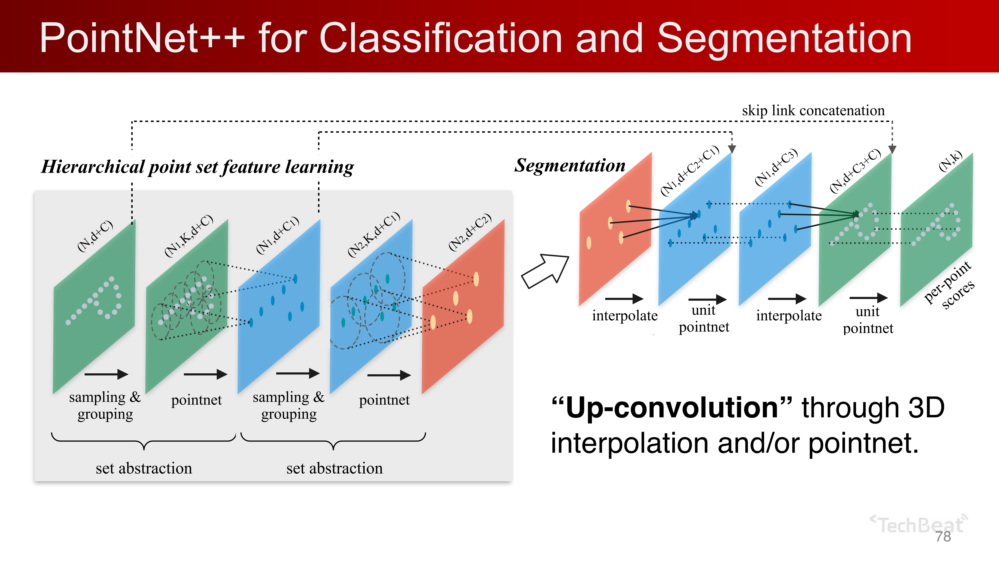

最后，我们将原来的点通过某些方法（比如说插值或者转置卷积），传回到原来的位置上，实现语义分割

实际上，可以将这些操作封装为层，或者说，实际上的三层（Sampling、Grouping、PointNet）就相当于卷积神经网络中的一层，如下图所示

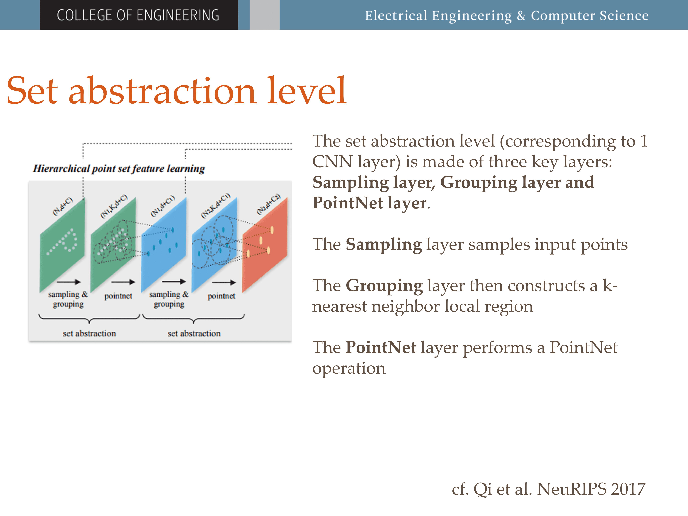

在实际操作的时候，Grouping层可以使用八叉树这些算法来实现快速的搜索，效率更高

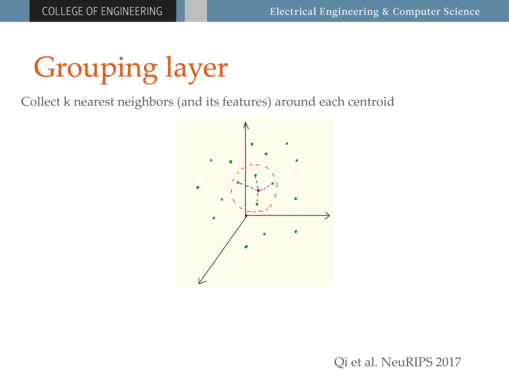

#### 问题：采样率不均匀

但是，这里有一个问题，就是这么选择每个小区域的大小，在二维网络中我们知道，大家都会选择非常小的感受野大小，比如说3x3，但是这在点云中不可能，场景的问题是采样率的不均匀（比如说远处的点更为稀疏，近处的点更为密集），最极端的情况下只有个别点，这种情况下，如果感受野太小会受到采样率不均匀问题的影响

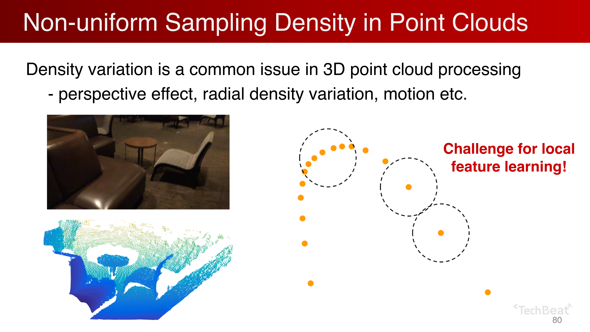

如果我们量化地研究这个问题，我们在不同点云数量的情况下分析

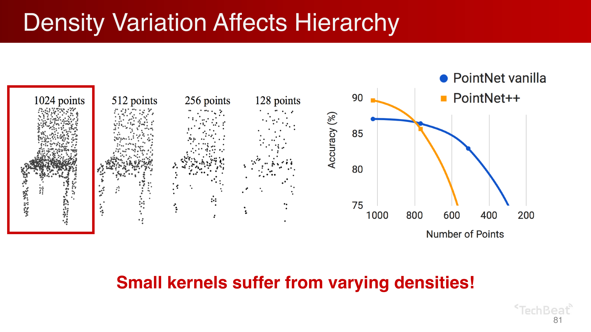

在刚开始1024个点的时候PointNet++比较强大，得到更高的精确度，随着点云密度的下降，其性能受到了极大的影响（由于核太小，采样率不均匀的影响很大），在小于500个点以后性能低于PointNet

点云的卷积也是卷积，也是针对连续卷积的离散化处理，不过点云中的卷积要考虑采样率不均匀的问题并且进行应对，考虑卷积在CNN中是一种均匀的采样，但是在点云中明显不合适，所以要做离散化的话就要除以一个距离

#### Multi-Scale Grouping（MSG）

我们面对采样率不均匀问题，可以使用这种方法去解决：每个点周围的多个不同尺度的邻域内分别进行特征提取（综合不同大小的区域的特征，在密集的地方相信这个特征，在稀疏的地方不相信这个区域并且查看更大区域的特征），然后将这些特征进行组合，形成一个多尺度的特征表示，这类似于GoogleLeNet中的Inception结构，不过这里增加了一个Dropout，来随机丢弃输入，来迫使网络去学习如何应对缺失数据和不同尺度的数据

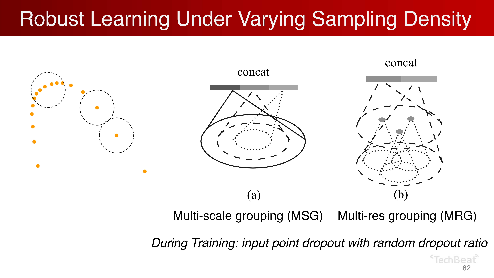

当然还有一个MRG（Multi-res Grouping）方法，这种方法的好处就是可以节省一些计算

#### 效果

可以看到，增加了这种结构之后，面对数据丢失，网络变的更加鲁棒，哪怕丢失75%的数据，精度也不会下降多少

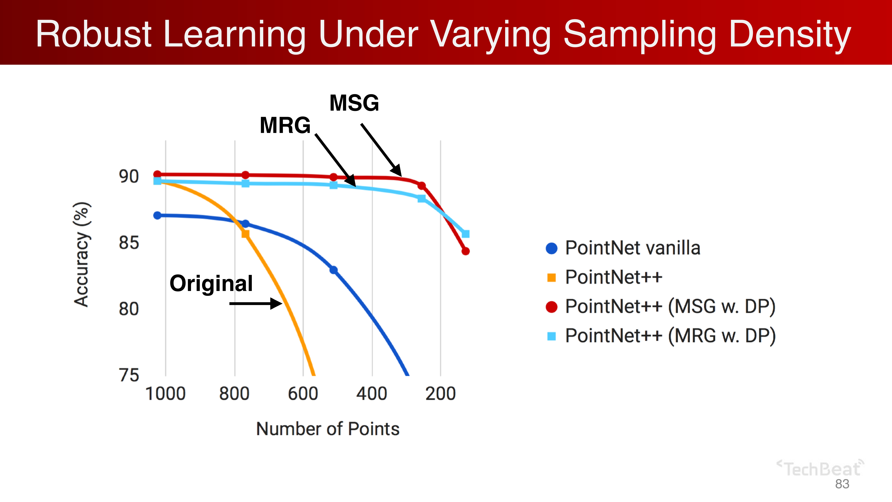

同时，在很多数据集上，PointNet++的精度也有所提高

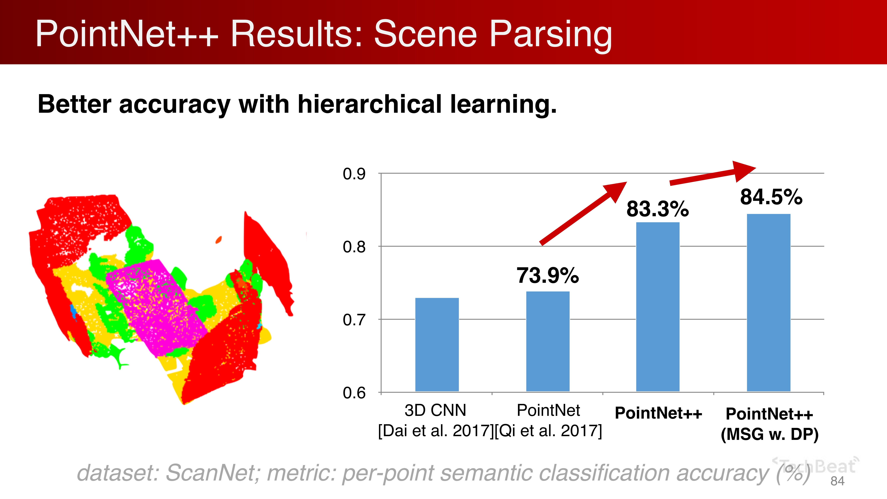

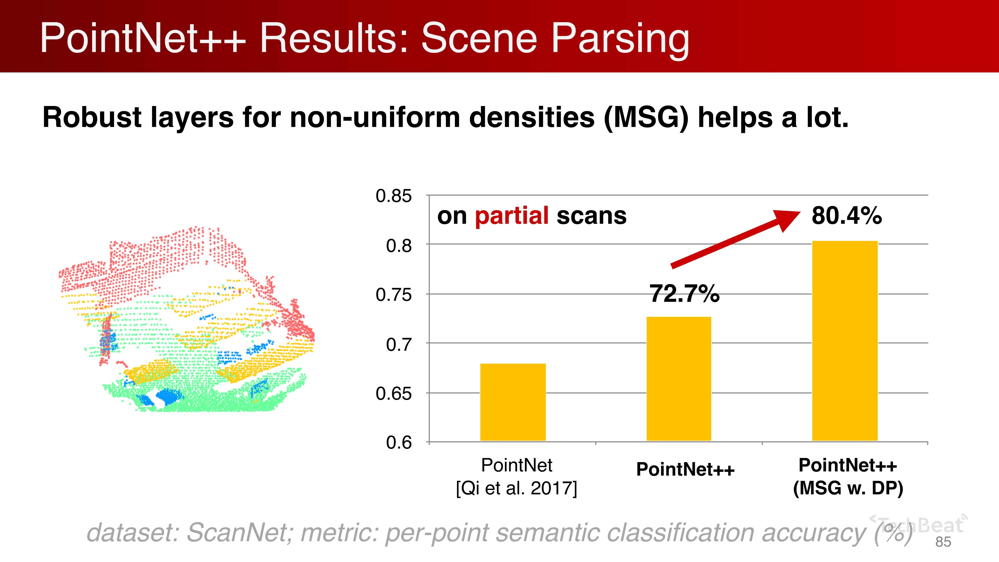

同时，PointNet++还可以拓展到非欧式空间上（或者说任意的测度空间），只需要有一个定义好的距离函数，我们将其用在一个可变形物体数据集上，比如说图中的ab两个物体，看起来很像但是不是同一个类别，ac两个物体看起来差异很大但是属于同一个类别

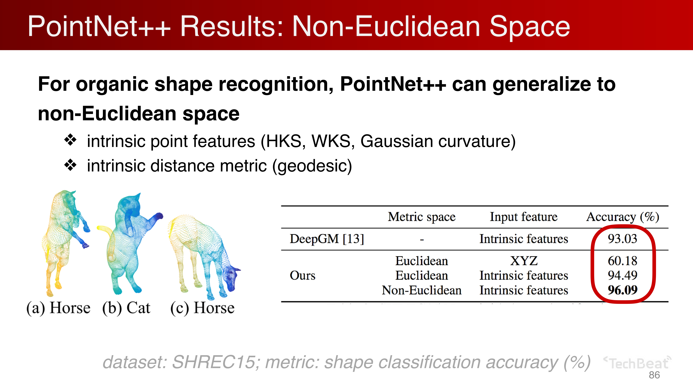

这种就无法通过坐标变换来分类了，而是通过表面的学习去完成

### PointWeb：增强点云处理中的局部邻域特征

这是PointNet++之后的一个工作，其核心思想就是尽可能利用局部邻域中的上下文特征，以便于更好地表示该区域，其核心单元就是**自适应特征调整模块（Adaptive Feature Adjustment，AFA）**，此模块作用为寻找点之间的相互作用，以便于更好地对一个区域进行编码

## 三维物体识别

我们输入RGB-D数据，然后我们希望使用一组边界框去标出这些物体，下图中的示例是在图像中的表达，实际上我们还会有在空间中的表达

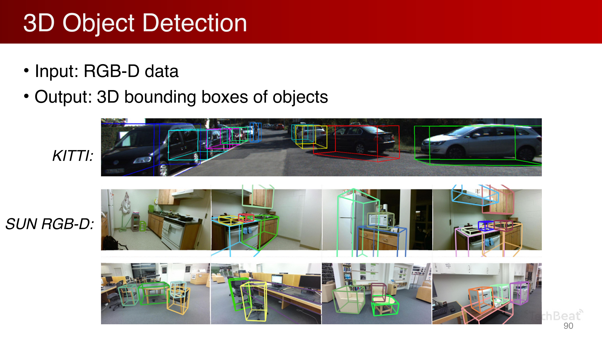

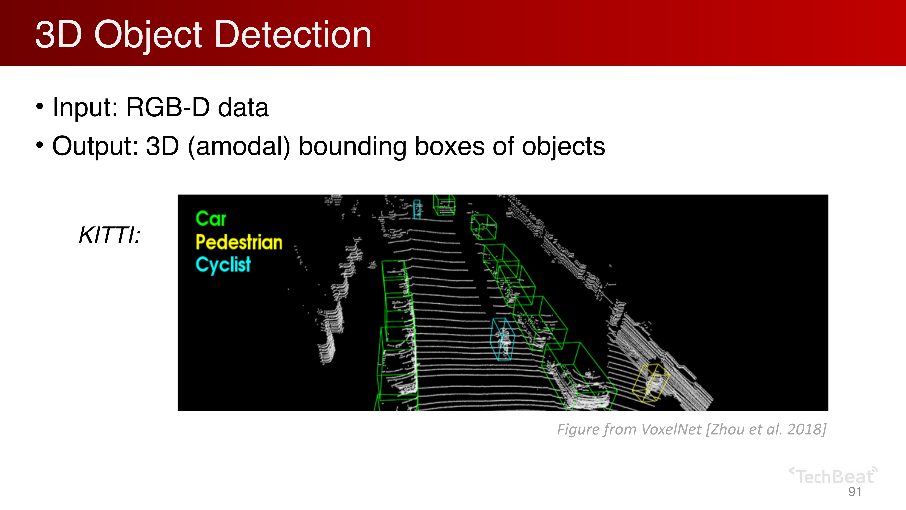

### 思路

我们这里的思路可能与二维中的Faster R-CNN一致，对一些候选区域进行分类

实际上，之前的工作也是这样的，第一种思路就是先在三维空间中筛选出候选区域，然后将其投影到二维图像上进行分类，然后将二维特征结合到三维特征上，但是这样有问题的，三维点云空间很大，计算量也会很大，同时因为点云的特性，也无法发现一些小物体

第二种工作就是基于图片的，这种方法依赖于对物体大小的先验知识，也无法精确估计物体深度和大小

然后，祁芮中台的思路是结合2D和3D的优点，我们先在二维图片上使用检测算法得到一个区域，如下图中我们检测出的车辆（红色框中），然后根据这个区域去生成一个**三维视锥（3D Frustum）**，即下图中红色四棱锥，然后我们就可以在这个视锥中搜索，或者在点云中搜索

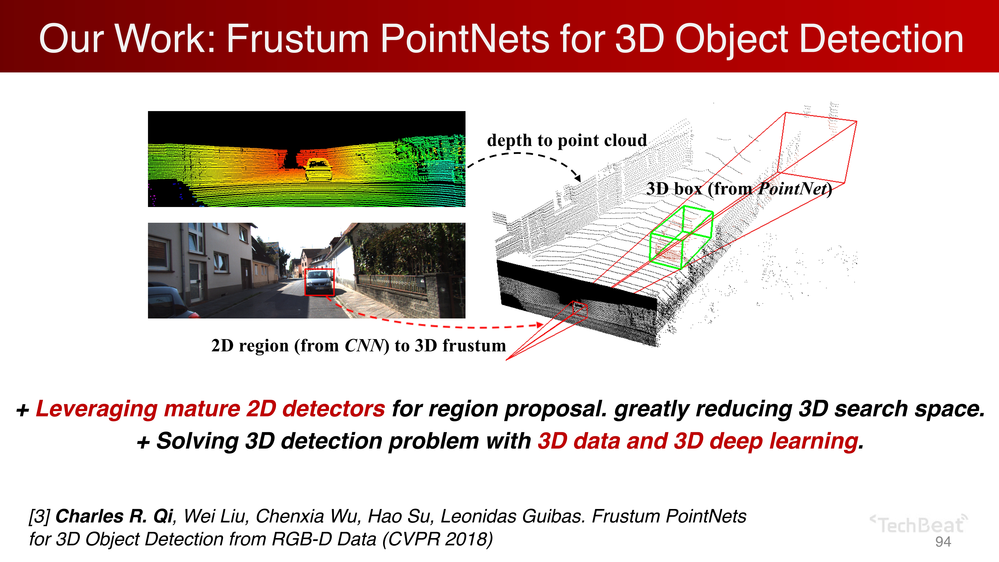

这种方法大大减小了搜索的计算量和复杂度，同时在视锥内，我们可以直接在点云上做操作，我们可以利用点云几何的精确性或者PointNet等去直接分析和处理点云数据，得到非常精确的三维边界框

### 挑战

首先，相比于二维目标检测，三维目标检测的表示多了一个维度的位置和尺寸，同时还增加了三个姿态角

此外，在有遮挡的情况下想去识别物体还是有挑战的

第一个就是有遮挡的情况，如下图所示，这个房子前面的人的一部分被遮挡了，我们根据二维区域去在视锥中进行搜索的时候，我们以上帝视角可以发现，这里的点云分布在非常大的尺度上，而这个人所对应的区域是非常小的一块点云，会有非常多的前景遮挡和干扰点，很难使用三维CNN方法等去处理

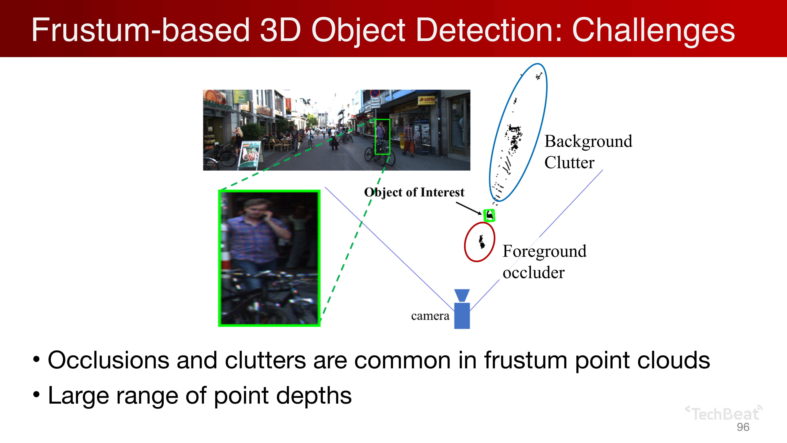

这里我们使用PointNet去处理

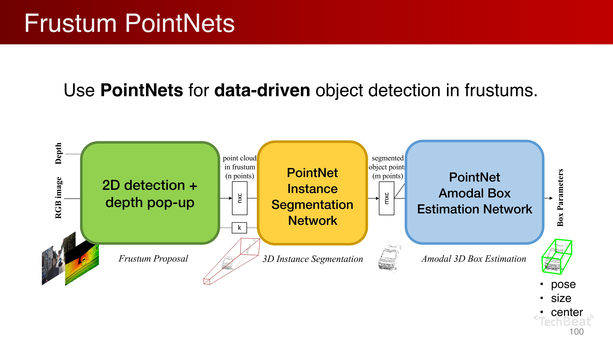

我们先在二维图像中找到这个区域，生成视锥，然后在视锥内搜索，找到后使用网络进行分割，检测出关键点，分割除去前景点和背景点，然后运行另一个网络进行姿态估计和标出边界框

这种方法的效果在KITTI数据集上很长时间排名第一

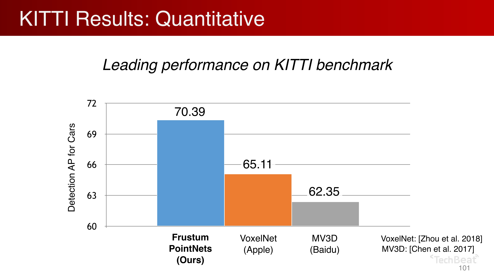

在一些小的物体上，比如说行人和自行车，这种方法的效果要优于其他算法

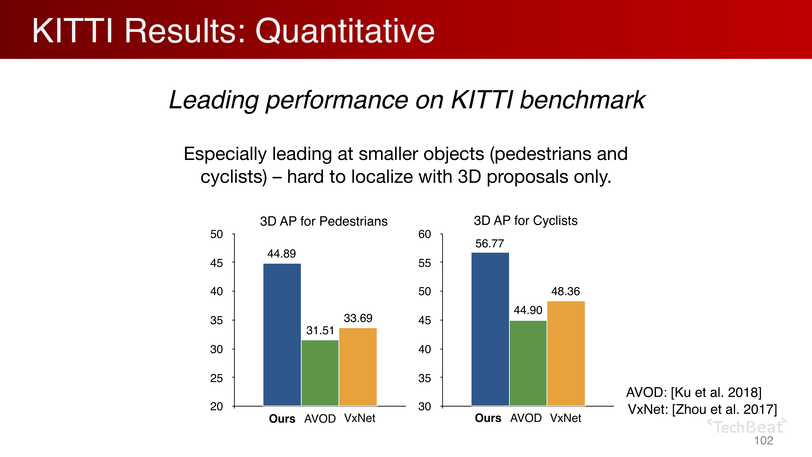

这是因为二维图像的分辨率是很高的，可以很容易的筛选出来这些目标

### 成功关键因素

这种方法成功的原因有两个

第一个是这种方法选择了三维的表示，相比于二维，有更好的分割效果，我们可以在二维上分割出一个掩码，然后将其投射到三维中

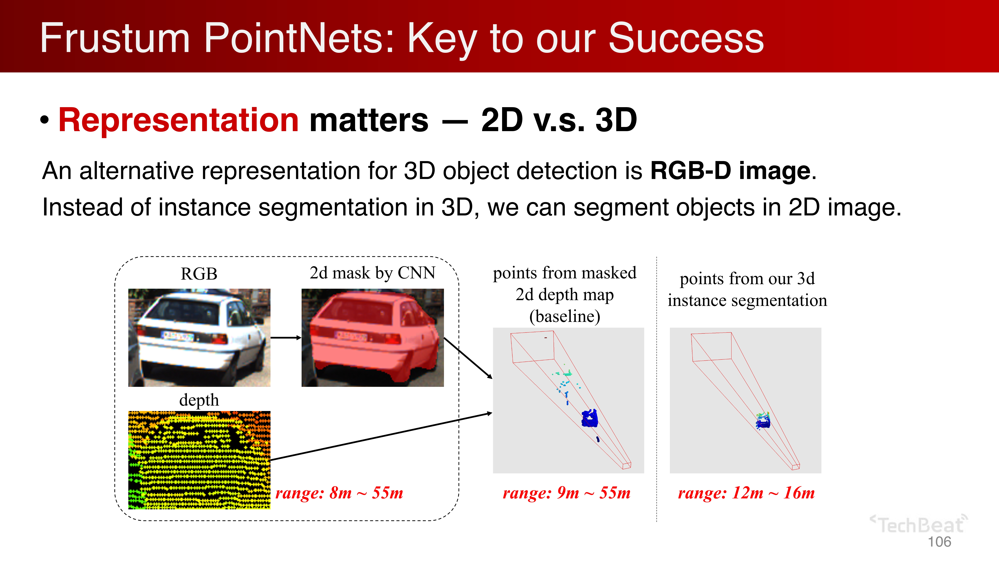

第二个就是可以进行输入归一化操作，简化学习问题

比如说我们有一个车处于视锥范围内，但是其不在中心位置，我们也只能看到一部分的侧面，同时因为视锥范围很大，X坐标的变化也很大，如下图所示

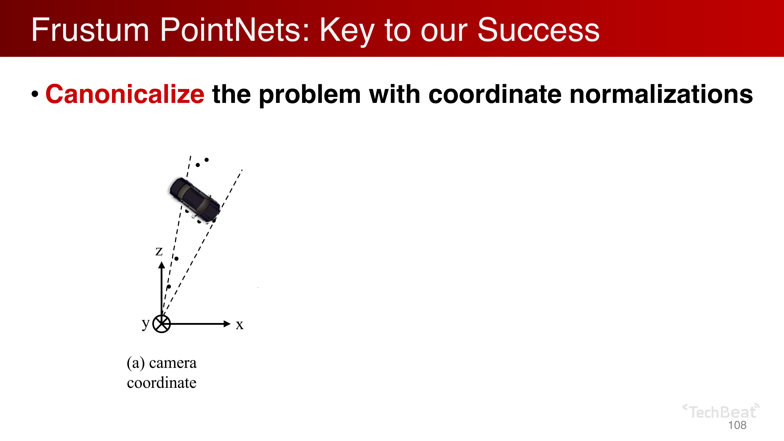

我们可以对坐标轴进行旋转平移，视锥中心就可以指向Z轴方向（如下图b所示），这样特征点在X的分布就会简化，学习起来也会容易；同时，物体深度也有很大区别，所以我们进行一个平移，我们基于三维物体分割可以找到分割后物体的中心，这样物体的点会集中在原点附近（下图c所示），便于学习，然后我们再使用一个网络，进一步预测物体真实的中心（下图d所示）

经过这一系列的操作，可以看到精度快速提高，而且这些操作只需要通过矩阵乘法实现

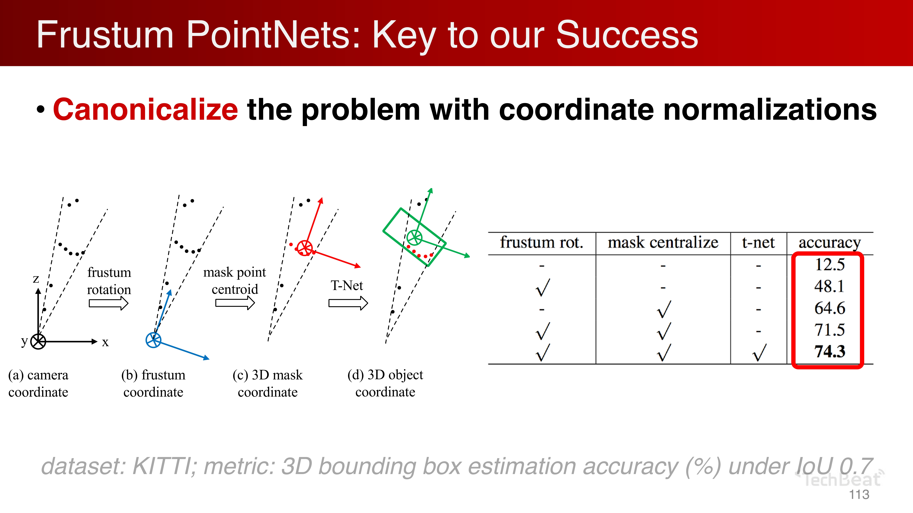

### 效果展示

室外，可以精准分割，哪怕两个物体很近

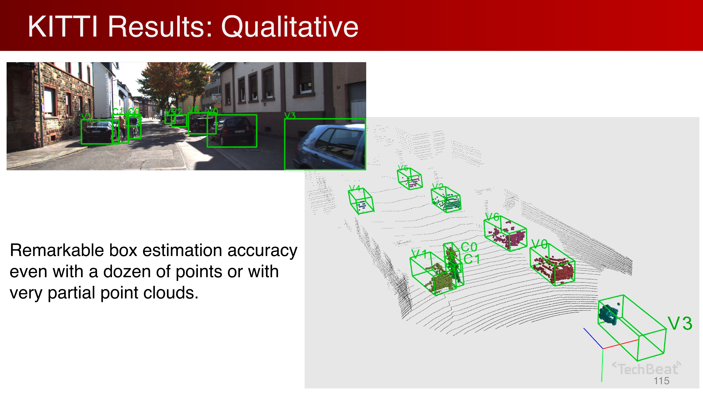

室内

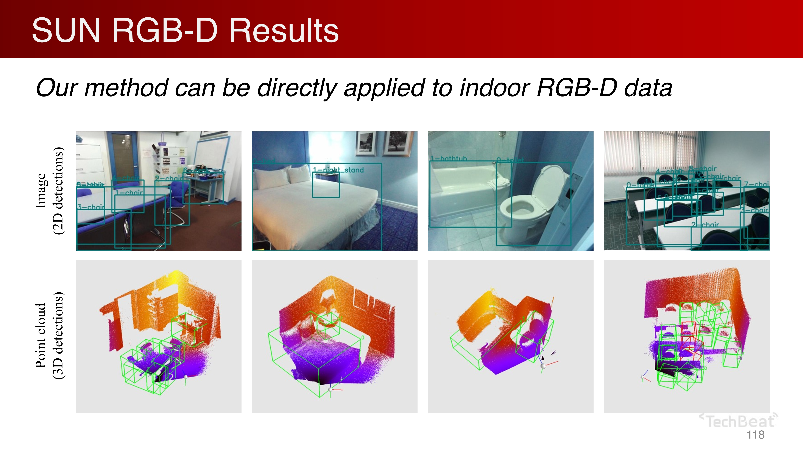

### 其他应用

AI辅助外形设计（工业4.0）

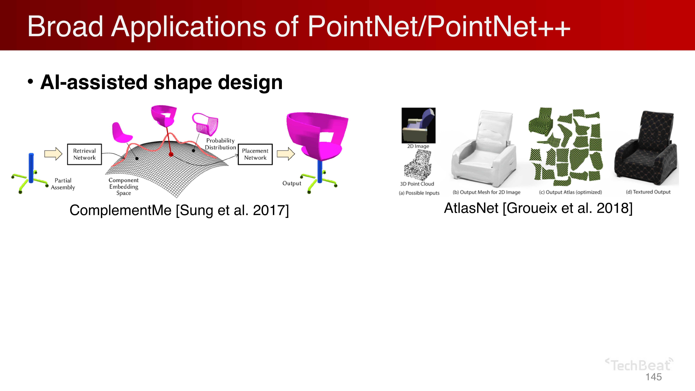

机器人的应用

蛋白质结构预测功能

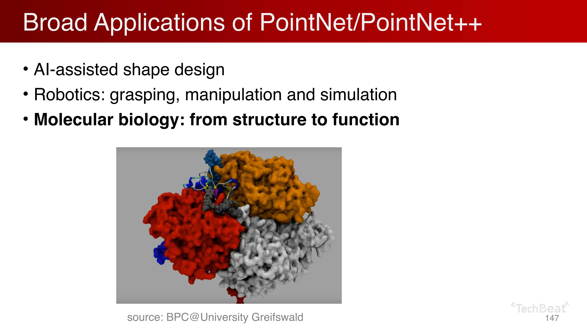

甚至用在更一般化的地方，比如说分析图片关系

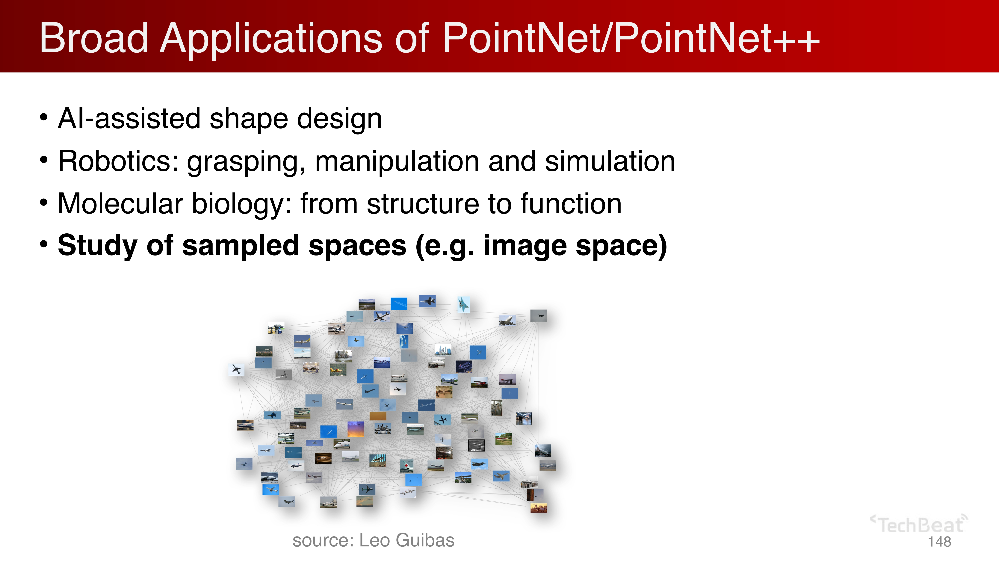

### 点云目标检测框架

目前的点云目标检测框架大概有这些

## PointRCNN：点云目标检测算法

### 介绍

PointRCNN是CVPR2019录用的一篇三维目标检测论文，曾在KITTI的3D检测测试中排名第一，文章为[PointRCNN：3D Object Proposal Generation and Detection from Point Cloud][https://openaccess.thecvf.com/content_CVPR_2019/html/Shi_PointRCNN_3D_Object_Proposal_Generation_and_Detection_From_Point_Cloud_CVPR_2019_paper.html]，这是一个两阶段的框架，先定位后精细化，与图像的两阶段目标检测算法思想类似

其两阶段的作用分别是：

- **第一阶段**：

  **目的**：分割前景点，并且生成3D bounding box proposals

  **方法**： 通过使用PointNet++作为骨干网络，提取point-wise feature vector，利用3D bounding box来生成ground-truth分割掩码，第一阶段分割前景点，同时在这些被分割出来的点中生成少些bounding box proposals。

  **核心思想**：学习point-wise 的特征来分割原始点云，在分割好的前景上生成3D 候选框。这样避免了在3D空间中使用大量预定义的3D框，极大地限制了3D建议框的搜索空间，从而减少计算

- **第二阶段**：

  **目的**：对生成的3D box进行微调

  **方法**：在3D proposals生成之后，用一个点云ROI pooling操作来处理第一阶段学习到的点。现存的3D方法都是直接估计全局box坐标，而作者的方法是将被池化的3D点转换到正则坐标，并且和来自阶段1的被池化的点的特征还有分割掩码结合，从而学习相对坐标微调。

  **优势**：充分利用了第一阶段分割和子网络提供的结果信息。

### 动机

基于点云的3D检测的困难主要在于点云的不规则性，常见3D检测的SOTA的方法：

1. 将点云投射到俯视图(AVOD)或者投射到前视图(MV3D)，利用2D检测的框架进行目标检测
2. 变成规则的3D voxels (VoxelNet)。

但这些都不是最佳的，而且投射的方法会遇到在量化过程中信息缺失的问题，并且三维卷积的计算量大。

后来有人提出PointNet，不将点云转换成voxels或其他的规则的数据结构来进行特征学习，而是直接从点云数据来学习3D表示，他们还在3D目标检测中应用了PointNet，从2D RGB检测的结果获得被截取点云，基于这个来估计3D bounding box（F-PointNet，视锥网络），但是这种方法过于依赖2D检测的表现，如果图像漏检或者重叠，都会带来较坏的结果。

### 网络框架

整体的网络架构如下

这是一个两阶段的目标检测框架，第一阶段生成一些候选区域，第二阶段进行候选框的回归

- stage-1：基于点云分割的3D RPN

  

  使用PointNet++作为骨干网络（或者说Encoder和Decoder），提取point-wise feature vector，然后区分前景点并且生成候选框

  （1）提取点云特征：使用PointNet++ 作为骨干网络提取特征point-wise feature vector

  （2）前景点分割：每个点的分类问题，由两个卷积层组成。输入是(bs,n,128)的特征（每个batch中，有n个点，每个点有128维特征），输出是(bs, n, 1)的mask（只是区分这个点是不是前景点）。由于背景点的数量远大于前景点数量，正负样本不均衡，所以分类误差损失函数选择使用focal loss

  （3）基于bin区间的3D框生成：也是由两个卷积层组成。输入是(bs, n, 128)的特征，输出是(bs, n, 76)。3d目标检测里的bounding box，需要7个量来表示：[x,y,z,l,w,h,yaw]。这里用基于bin的预测方法使76个维度特征来代表这7个量，然后进行非极大值抑制（NMS），得到一批预选3d区域

  其中基于距离的NMS是这样处理的：

  - 在相机 0～40m距离内的bounding box，先取得分类得分最高的6300个，然后计算bird view IOU，留下IOU大于0.85的，到这里bounding box 又少了一点。然后再取得分最高的210个。
  - 在距离相机40～80m的范围内用同样的方法取90个。这样第一阶段结束的时候只剩下300个bounding box了。
  - 再送入stage-2进行置信度打分和bounding box优化。

- stage-2：基于bin区间的3d框回归

  

  3D box： ( x , y , z , h , w , l , θ ) 

  bin就相当于直尺上的刻度，用绿色大括号表示。这里设物理空间中0.5m是一个bin。通过分类的方式去预测每个点对于bounding box中心点偏移了几个bin（或者说预测中心点落在哪一个bin里面），而不是直接回归具体的位置，其中蓝色的是分割出来的前景点，紫色的是兴趣前景点，以兴趣前景点为例去进行预测

  旋转角也用这种基于bin的方法预测，是把π话分成若干个bin。由于bin是一个整数，还是无法精确定位，所以还需要预测中心点坐标在一个bin中的偏移量。

  此外，76维输出向量是如何对应7个参数的呢

  

  76维的前12维，x\_bin，是判断X轴的bin区间，判断中心点落在哪一个bin上，12维表示坐标轴正负各有六个bin，然后还有在每个bin上的回归，x\_res，也占了十二个维度，然后在XZ方向上都是如此操作，就占了48个维度

  但是在Y方向（或者说垂直方向）上没有这种划分，因为自动驾驶的目标物体都是在地面上的，所以不会出现太大的出入，只有一个一维回归

  然后YAW角也是基于bin的划分，12个bin区间和12个偏移量

  最后对长宽高也是有回归，占3维

## 3D SSD

### 概述

3D SSD方法，原论文3DSSD: Point-based 3D Single Stage Object Detector，是一种借鉴二维SSD方法的

## CenterPoint：点云目标检测

### 概述

CenterPoint是一个点云目标检测的框架，借鉴了YOLO、SSD等单阶段二维目标检测框架的思想，直接检测隐式的物体中心，不需要候选框