# 视频

## 概念

我们之前介绍了三维视觉，实际上三维视觉就是在二维视觉的基础上增加了一个空间维度，今天我们要讨论的视频，实际上也是这样的，不过这里增加的是一个时间维度，**视频就是一个随时间展开的图像序列**，或者说视频就是一个四维张量，两个空间维度，一个时间维度，一个通道维度

当然，这里的预测就复杂一些，因为传统的目标检测任务我们只需要确定单个图像中的不同对象就可以，但是在视频任务中，我们需要对动作来进行分类或者语义分割，数据集是一些带有类别标签的视频，损失函数毫无疑问就是交叉熵损失

实际上，我们在视频中识别是很有用的，我们在二维识别任务的时候，经常识别物体，但是这些都是具有某种空间范围的物体，但是在视频序列中，我们要分类的是动作或者活动，比如说游泳、跑步等等，这与二维任务有很大的区别

还有一点需要指出，大多数时候，在视频中我们所关心的动作实际上不仅仅是任意动作，而是人类正在执行的实际动作，所以实际上你会发现视频分类数据集的大部分视频中，大多数人都有一个类别标签，对应不同类型的动作

## 限制

但是，在视频分析中有一些限制，就是视频数据集很大，这是一个处理视频数据时候需要克服的主要限制

以每秒30帧的速度拍摄的视频，如果空间分辨率是640x480的话，那么每分钟会产生1.5GB的数据，这就是原始的视频数据集，如果是高清格式的1920x1080的话，一分钟的视频会是10GB大小，我们无法将如此之大的数据放入我们的GPU显存

当然也是有解决方法的，那就是我们只在一个短视频片段上进行训练，并且这个视频片段的帧率会比较低（通过采样方式），同时我们可能会使用各种下采样操作使得视频空间分辨率更低，这样就容易训练，比如说一段三五秒并且帧率为五的视频，大小可能为数百KB，或许这不是一个很好的方法，但是在计算限制的情况下，为了使得神经网络可以训练，我们不得不这样处理

在原始视频中，时间长，帧率高，所以我们在训练的时候，需要进行剪辑和子采样，得到一些**片段（Clips）**去训练；在测试的时候，我们可以在原始视频的不同地方进行测试

## 视频分类：单帧CNN（Single-Frame CNN）

在视频分类中，"Single-Frame CNN" 是一种基于单帧图像的卷积神经网络方法， "Single-Frame" 指的是单个帧图像，也就是视频的每一帧。该方法将视频分类任务简化为对视频中每个单独帧图像进行分类，并使用单帧的特征来表示整个视频，训练和测试也都是在单帧上进行。

这种方法的主要思想是将视频中的每个帧图像作为独立的样本，通过单帧图像的特征提取和分类来对整个视频进行分类。通常，这个方法将每个单帧图像输入网络中，提取图像的特征表示，然后通过全连接层或其他分类层进行视频分类。

这种方法的优点是简单直观，易于实现和理解。它适用于那些不涉及时间序列建模和动态变化的视频分类任务，例如静态场景下的动作识别或物体识别。

但是缺点是，他忽略了序列中的上下文信息，或者说忽略了时间维度的结构，对应动态场景下的视频分类可能有所不足

不过，这也是一个非常强大的Baseline，后面可以在上面进行各种的改进，去适应不同的视频分类任务

## 后期融合（Late Fusion ）

在视频分类中，"Late Fusion" 是一种融合多个模态（或多个特征）的方法，其中各个模态或特征的融合发生在分类的最后阶段。

"Late Fusion" 的基本思想是，首先对每个帧进行独立的处理，然后在最后阶段将它们的分类结果进行融合，以得到最终的视频分类结果。

每个输入图像都有四个特征维度，经过CNN提取特征之后，有时间维度、通道维度和两个空间维度，进行展开之后就变成一个很长的特征向量（融合了所有信息），然后使用多层感知机进行分类。这是最早的融合方法。

具体而言，"Late Fusion" 方法可以应用于多个不同的特征表示，如图像特征、音频特征和文本特征等。对于每个特征，可以使用相应的模型（如卷积神经网络、循环神经网络、文本分类模型等）进行处理和分类。然后，通过一定的融合策略（如简单的加权求和、投票或决策级联等），将各个特征的分类结果组合起来，得到最终的视频分类结果。

当然这种方法因为可学习参数过多，容易导致过拟合，所以我们进行了一些改进，我们使用全局平均池化方法，整合了所有的空间信息和时间信息，然后使用一个线性层进行分类，这也是一个简单的方法

后期融合的方式有一些缺陷，比如说上图中的多帧图像，人在重复性的完成抬脚这个动作，但是后期融合方法很难学习到输入视频帧中相邻像素之间的交互，因为我们实际上是将图像信息总结到一个向量中，所以网络难以比较这些低级像素

实际上后期融合也存在一些问题和缺陷，包括：

1. 信息丢失：由于每个模态或特征在分类前都是独立处理的，"Late Fusion" 可能会导致一些模态之间的信息丢失。模态之间的相互关系和交互可能无法被充分利用，从而降低了整体的分类性能。
2. 计算复杂性：当涉及到大量模态或特征时，"Late Fusion" 需要在最后阶段对各个模态的分类结果进行融合。这可能会增加计算复杂性和时间开销，尤其是在处理大规模视频数据时。
3. 高度依赖特征提取："Late Fusion" 方法的性能很大程度上依赖于每个模态或特征的独立特征提取过程。如果某个模态的特征提取不准确或不可靠，整个融合结果可能会受到影响。
4. 缺乏模态关联性：在 "Late Fusion" 中，模态之间的关联性和时序信息没有得到充分考虑。视频中的模态可能是相互关联的（如图像和音频），而 "Late Fusion" 无法有效利用这些关联性，导致潜在的信息损失。

为了克服这些问题，研究人员已经提出了其他融合策略和方法，如早期融合（Early Fusion）、多模态注意力机制（Multimodal Attention Mechanism）、多任务学习（Multitask Learning）等。这些方法旨在更好地利用模态之间的关联性和交互信息，提高视频分类的性能和鲁棒性。

## 早期融合（Early Fusion）

这里与后期融合相反，它将不同模态的特征在输入阶段进行融合，然后将融合后的特征传递给分类模型进行处理，具体方法如下：我们先使用二维卷积网络对视频帧进行处理和提取特征，不过这里的一个改进就是使用Reshape的方法，将输入的四维张量改为三维张量，沿着通道维度堆叠所有帧数据，这样可以折叠时间信息，然后就可以使用二维卷积网络进行特征提取了

使用这种方法，我们就可以学习相邻视频帧直接是否有局部像素运动，接近了后期融合的问题

但是，这种方法也有问题，它破坏了二维卷积层之后的时间信息，使得模型无法学习到视频序列中发生的时间交互

## 3D CNN

这种方法也叫Slow Fusion，有点类似于三维视觉中处理体素网格的网络，其用于处理视频数据的时空信息。与传统的2D CNN不同，3D CNN可以直接在视频序列中进行三维卷积操作，在网络的每一个层中，都有卷积和池化函数，从而捕捉视频中的时域和空域信息（或者说融合各种信息），不过这个速度比较慢，所以其被称为Slow Fusion。

3D CNN的基本思想是将视频序列视为一个时域和空域上扩展的三维数据体。它通过在时间维度上进行卷积操作，从视频序列中提取时域特征，并在空域上捕捉物体的形状、结构和运动信息。

优点如下：

- 3D CNN能够利用视频中的时域和空域信息，从而更好地捕捉视频的动态和运动特征。
- 它可以直接在视频序列中进行卷积操作，避免了手动提取时域特征的繁琐过程。
- 3D CNN在处理视频数据时具有较好的表达能力和泛化能力，能够有效地捕捉视频中的空间和时间关系。

缺点：

- 3D CNN在处理视频数据时需要大量的计算资源和存储空间，导致训练和推理的时间开销较大。
- 由于视频数据通常较长，3D CNN可能会受到长序列的内存消耗和梯度消失问题的影响。
- 3D CNN需要大量的训练数据来获得良好的性能，这可能对数据收集和标注带来一定的挑战。

## 对比

我们对上面三种不同的模型进行对比，比较内容就是他们如何处理数据的，以及不同阶段的感受野，我们先看一下后期融合方法

在后期融合中，我们使用全局平均池化层，实际上就是将感受野范围扩大到全局，获取不同视频帧的特征，后期融合中不同层对于输入数据的实际感受野如下图所示，可以看到，经过不同的层，实际上空间维度上的感受野是在缓慢增长的

然后对比一下其他方法

可以看到，前期融合与后期融合的唯一不同，就是第一层网络就在整个时间范围内建立了感受野

在3D CNN中，我们使用三维卷积核，在时间和空间上滑动，然后池化操作不仅仅是在空间维度上进行折叠，而是在空间和时间上都进行折叠，这时候，感受野在时间和空间上都在慢慢增长，网络在缓慢地融合时间空间信息

## 二维卷积 VS 三维卷积

虽然在上面的方法中，我们都是使用卷积操作建立了时间和空间上的感受野，但是二维卷积和三维卷积的卷积方式有明显不同，这种不同是有用的，我们回想一下早期融合方法，我们改变后的输入是一个三维张量，两个空间维度，一个时间维度，我们想象这个三维网格中的每个点都有一个特征向量，如果使用二维卷积处理，那么实际上卷积核就是在空间维度上延伸了一小块，但是占据了整个时间深度，这意味着卷积核与输入视频序列有同样的时间大小，并且输出就是一个二维张量

这是一种很简单的方法，但是有很大的缺点，它并没有一种时移不变性，是在输入阶段将多模态数据进行融合，这种融合操作并没有考虑到时间上的顺序和变化，因此在时间上并不具备时移不变性，这是对视频序列使用二维卷积方法的限制

但是三维卷积方法则不然，三维卷积核在时间和空间上都延伸一个区域进行卷积，滑动之后就可以产生标量输出，这样就可以解决了时移不变性问题

因为卷积核在时间和空间上都很小，所以可以学习到的东西大概就是一个运动片段，我们将卷积核学到的东西用一个简短视频片段的形式表示出来（如下图所示，当然这里只是一个图片而不是一个视频片段，课程中的这些小片段大概就是一些简单运动的低级纹理特征）

## 视频数据集

我们有了视频分类的理论之后，还需要数据集才可以进行，有一个名为Sports-1M的数据集，这是谷歌的一些乘以在youtube上拍摄的一些体育视频，然后加上不同的注释

## 性能对比

我们可以对比一下不同的方法

首先我们看单帧的方法，尽管这种方法非常简单，但是性能表现上却很不错，再一次证明了单帧模型作为一个Baseline的效果有多好，尽管这是一个非常早期的（2014年）工作

当然我们发现，在时间维度上进行卷积的CNN方法效果是最好的

## C3D模型

这是另一个三维视觉中很出名的模型，大概就是三维版本的VGG网络

这是一个很简单的网络，由3x3x3的卷积核和大小为2的池化层构建，与二维版本的VGG网络基本一致，这也是一个很有影响力的模型，此外作者公开了预训练模型，便于大家训练自己的权重

当然，这个网络的缺点还是计算量大，因为使用了很多个三维卷积核

不过不考虑计算量问题，C3D模型很好的提高了视频任务的上限

或者这也可以给我们带来一些启示，比如说增加网络深度来更好的拟合，或者添加残差连接和批量归一化等等，不过也有一些更值得思考的地方，就是我们如何让网络对运动更为敏感，因为人类可以只通过运动去得到很多信息，识别出来很多东西

# 运动（Motion）

## 从运动中识别行为

人类可以通过一些低层次的运动中就可以获取很多信息，比如说视频中，哪怕只有一些点在运动，人也可以看出来这些点在干什么，或者说，人在处理运动和视觉之间会议一些区别

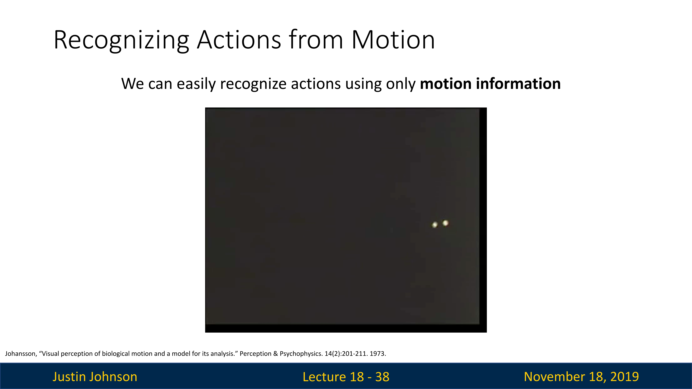

所以，人们开始研究可以感知运动的神经网络，或者说试图更明确地将运动信息作为网络内部的一个基元来表示

为了具体的去描述运动信息，或者说怎么使用计算机去定量的测量运动信息，这里需要使用光流的概念

## 光流（Optical Flow）

把一对相邻的视频帧作为输入，然后计算两个相邻视频帧之间的一种流场或畸变场，这样就可以计算出来第一帧中的每个像素在第二帧中移动的位置，并且存储起来，这样我们就可以通过光流算法计算出视频帧之间有哪些像素产生了什么移动，可以凸显出场景中的局部运动

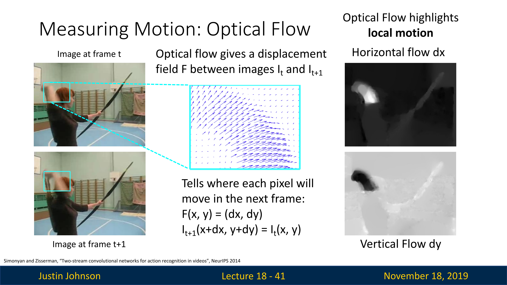

我们可以将这种运动局部可视化出来，如上图右边所示，当然，光流法提取的也是关于运动的低级信号，可以将其传递进CNN中进行特征提取，有一种框架就可以完成这个操作

## 双流网络（Two-Stream Networks）

这是一种很有名的框架，旨在分离视频中的运动信息和视觉外观信息，该模型基于两个独立的网络流，分别处理光流（运动）和图像帧（外观）数据，以捕捉视频中的运动和外观特征。

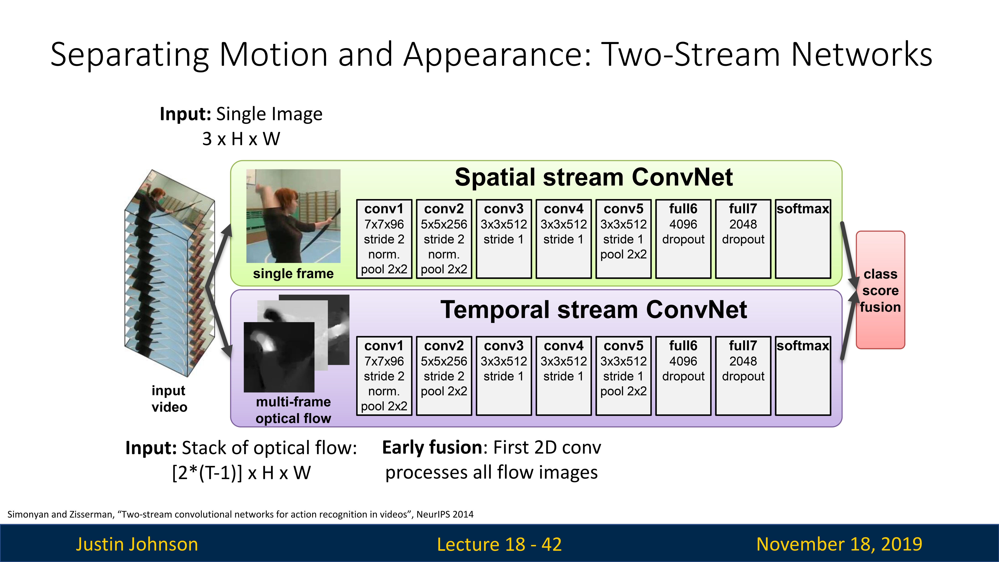

Two-Stream Networks的基本思想是通过并行处理运动和外观信息来提高视频理解的性能。具体而言，它由两个并行的神经网络堆栈组成：

1. 光流网络（Optical Flow Network）：这个网络处理输入的光流数据，光流是描述相邻帧之间像素级别运动的矢量场。光流网络旨在学习并捕捉视频中的运动模式和运动信息。它可以采用传统的光流算法（如Lucas-Kanade或Farneback）或深度学习方法来估计光流。
2. 图像网络（Image Network）：这个网络处理输入的视频帧数据，即图像。它旨在学习和提取视频帧的外观特征和静态信息，如物体的形状、纹理和颜色等。图像网络通常是基于卷积神经网络（CNN）的结构，如常用的ResNet、VGG等。

光流网络和图像网络的输出特征通常会被融合在一起，以综合考虑运动和外观信息。融合可以通过简单的连接、加权平均或其他融合策略来实现。

Two-Stream Networks的优势在于分离处理运动和外观信息，从而更好地捕捉视频中的动态和静态特征。这种分离处理可以提高模型对运动和外观的感知能力，并有助于解决一些视频分析任务，如动作识别、行为识别、动作检测等。

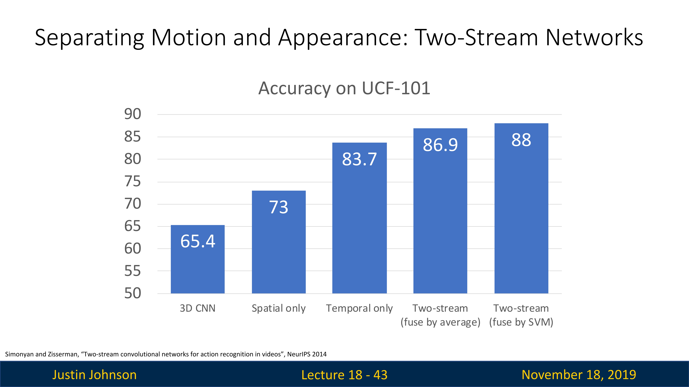

从效果上来看，双流网络的效果比之前的几种方法都要好，这种从运动中识别活动的方法可能并不是我们的大脑所特有的，我们的人工神经网络也可以实现仅仅通过运动信息来识别活动

# CNN与RNN结合处理视频序列

## 概念

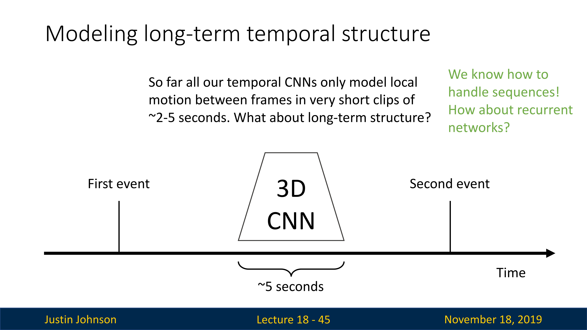

截止目前，我们已经看到了很多短期结构建模方法，比如说使用二维卷积或者三维卷积，但是这些操作都非常局部，三维卷积不过是感受野的逐步增长，光流也是只观察相邻帧间的运动，这是有局限的，我们需要一些可以长距离识别的CNN架构，毫无疑问，RNN就很适合这种长期的全局结构，我们可以将两种框架结合起来使用

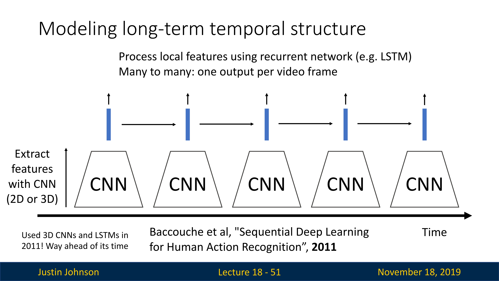

我们的想法是这样的，我们先使用CNN去对每一帧提取特征（提取局部特征），然后使用RNN去接受这个特征序列来处理，如果我们想在视频最后进行决策，我们就可以使用一个多对一的序列（如上图），这一点像时间空间维度的信息进行融合

或者我们也可以完成多对多的任务，对视频的每一个点进行预测，实际上2011年就有一篇论文使用LSTM来融合这种，当然这种想法非常超前

当然，这里有一种技巧就是只在RNN中进行反向传播，CNN只作为一个固定的特征提取器（单独完成预训练），这样就可以解决一些内存限制问题，可以在一个长时间上训练模型

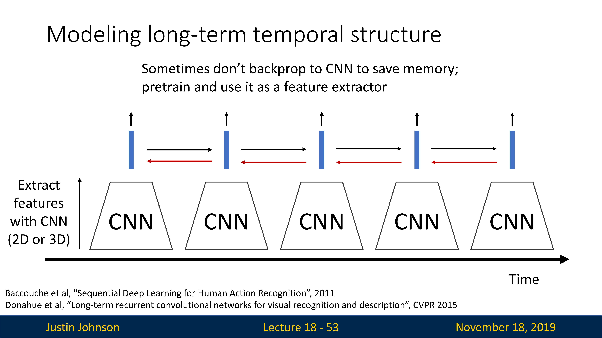

现在我们已经看到两种不同的合并时间信息的方法，一种是在CNN内部使用某种操作，在本地合并信息，另一种是先运行我们的CNN提取特征，然后使用RNN进行融合，或许我们可以使用一下多层RNN的方法去应用到这些里面

## 多层RNN的应用

我们有一个多层RNN的网格，在网格中的每一个点，向量都依赖于同一个时间步的前一层输出和前一个时间步的向量，天眼查我们可以使用序列上权重共享的方法来处理视频序列

当然，我们这里做的就是，改变我们的网络结构，使其可以处理三维张量，然后对信息进行融合，这里每一个点的特征向量都会融合前一层同一个时间步的特征和同一个时间步前一层的特征

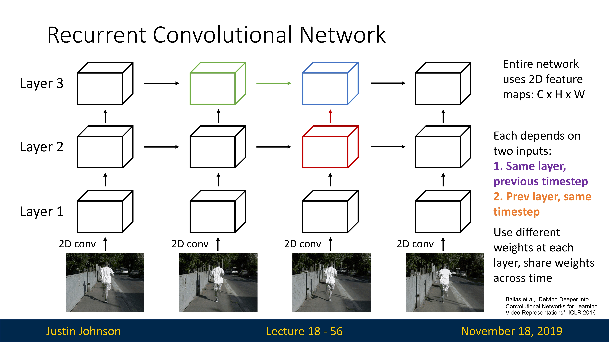

在常规的二维卷积中，我们输入的是一个三维张量然后输出一个三维张量

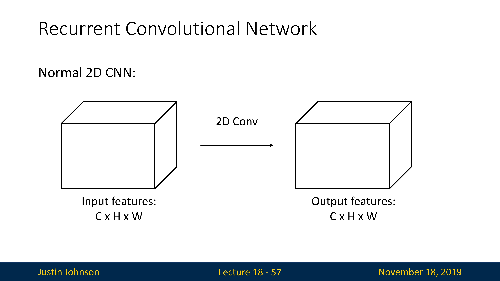

但是在这里，我们使用两个特征张量作为输入

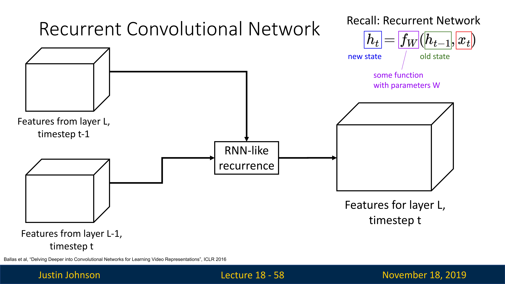

我们想使用某种类似于RNN的方式去融合他们，或者这种方式就是先CNN处理然后直接求和？

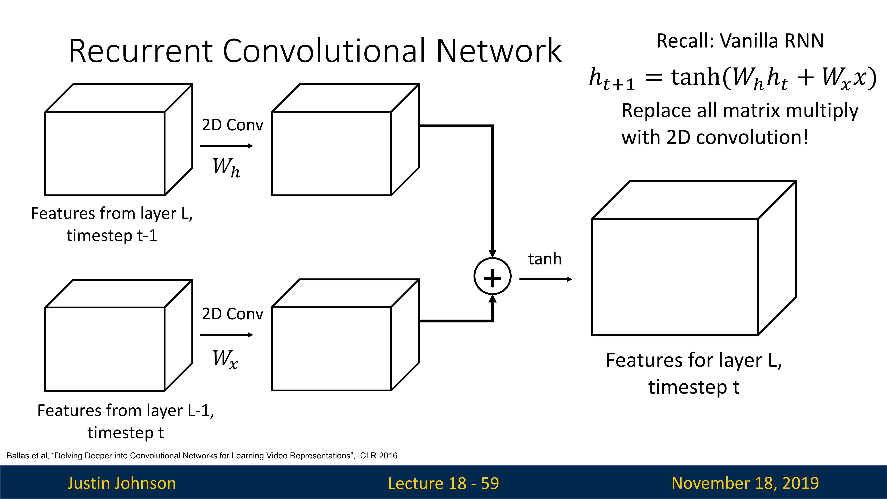

使用CNN和多层RNN结合进行视频分析是一种常见且有效的方法。这种组合可以充分利用CNN对空间特征的提取能力和RNN对时序信息建模的能力，从而实现对视频内容的全面理解和分析。

具体而言，以下是使用CNN和多层RNN进行视频分析的一般流程：

1. 视频帧特征提取：首先，通过CNN模型对视频的每一帧进行特征提取。CNN可以通过卷积和池化操作从每个视频帧中提取出空间特征表示。这些特征可以捕捉到物体的形状、纹理和空间布局等信息。
2. 序列建模：接下来，将CNN提取的特征序列输入到多层RNN中进行序列建模。RNN可以有效地处理时序数据，并捕捉到视频中的时序关系和动态特征。多层RNN模型可以更好地捕捉到不同时间尺度上的时序模式。
3. 上下文建模：为了更好地理解视频中的上下文信息，可以使用双向RNN或注意力机制来对上下文进行建模。双向RNN可以同时考虑过去和未来的信息，而注意力机制可以根据当前的特征权重自适应地调整上下文的重要性。
4. 输出预测：最后，通过在RNN的顶部添加全连接层或输出层，将序列建模得到的特征映射到视频分析任务的具体输出。例如，可以用于分类任务的Softmax层、用于目标检测的边界框回归层等。

使用CNN和多层RNN进行视频分析的优点是能够捕捉到视频的时空信息，并对视频中的动态变化进行建模。这种组合可以应用于各种视频分析任务，如动作识别、行为识别、视频描述生成等。然而，它也面临一些挑战，包括模型的复杂性、训练和推理的计算成本较高等。

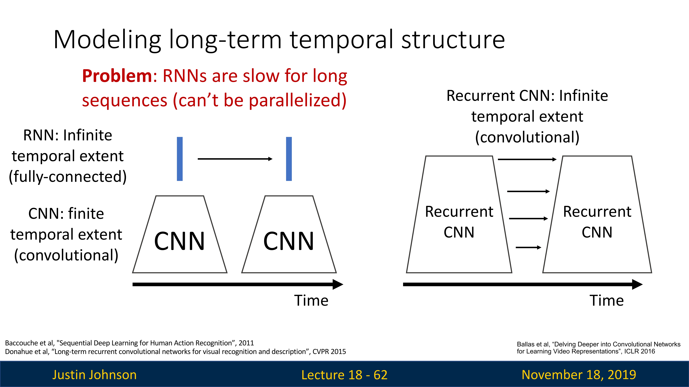

上面的方式实际上结合了两种不同网络架构，融合空间和时间信息，或者可以成为**循环卷积神经网络（Recurrent CNN）**更合适一些，不过这种架构也有RNN的缺点，就是无法并行化处理，下一步的信息必须依赖于上一步的输出，导致在长序列的时候非常慢

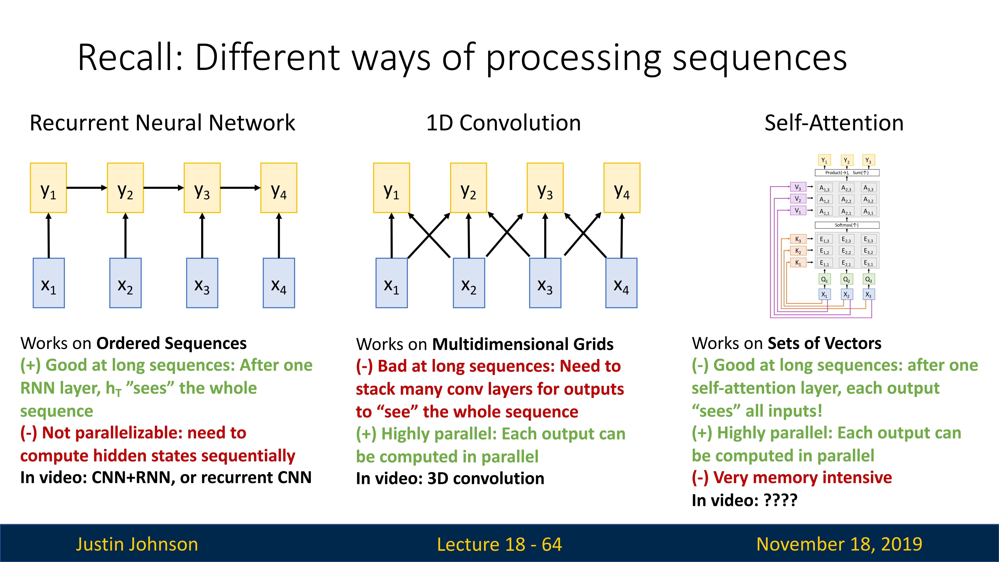

不过，我们或许可以回想一下自注意力层，或许可以帮助我们去处理视频

## 注意力机制

在这里我们可以考虑一下注意力机制，它很擅长处理厂序列，它是高度并行化的，并且结构上没有时间依赖性，所以我们可以尝试一下使用注意力机制来处理视频

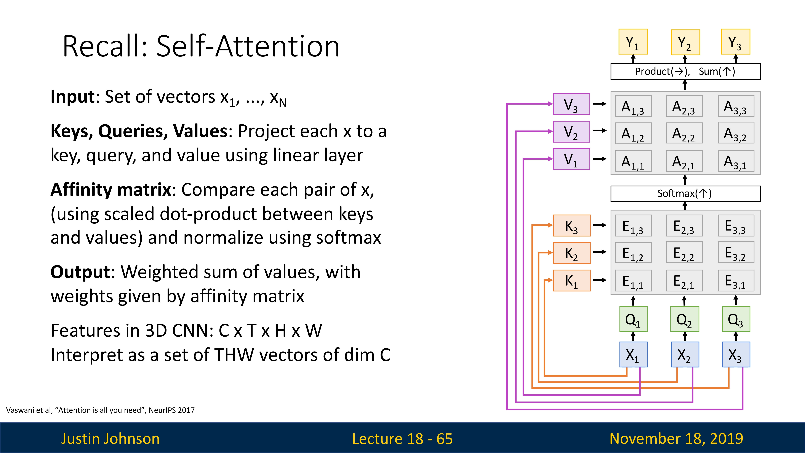

那么我们如何具体的去应用这个注意力机制呢？

如下图所示，我们先使用三维卷积去提取特征，输出是一个四维张量，分别计算查询张量、键张量、值张量，然后使用查询张量和键张量去计算注意力权重，然后与值去进行相乘，然后进行一次1x1x1卷积核残差连接构成输出，这样就得到了一个视频版本的自注意力层（或者叫**Nonlocal Block，非局部块**）

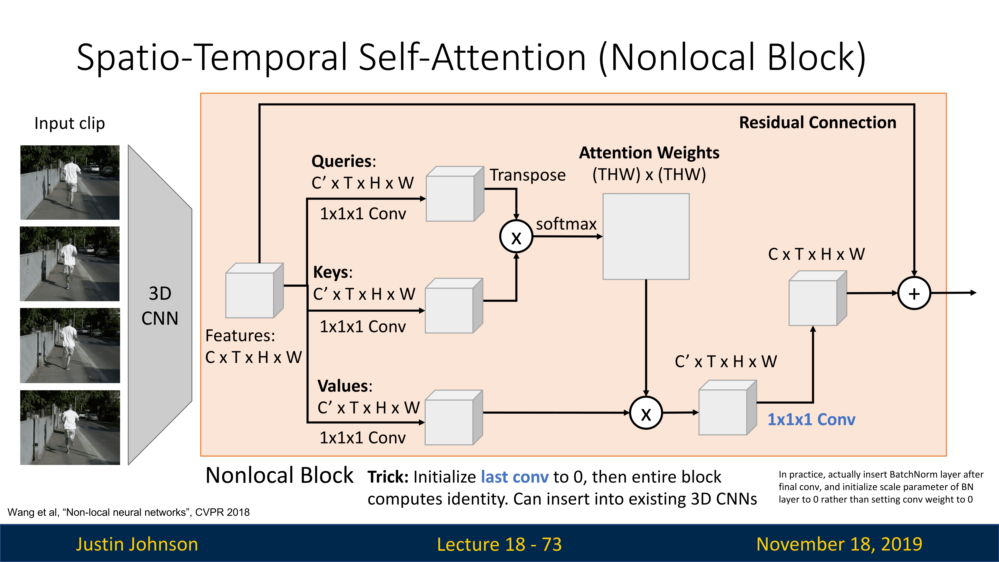

然后我们就可以使用这个块，插入到三维卷积网络中进行应用，便于网络进行微调，促进网络在时空信息上的全局融合，这是一个非常强大的视频识别框架

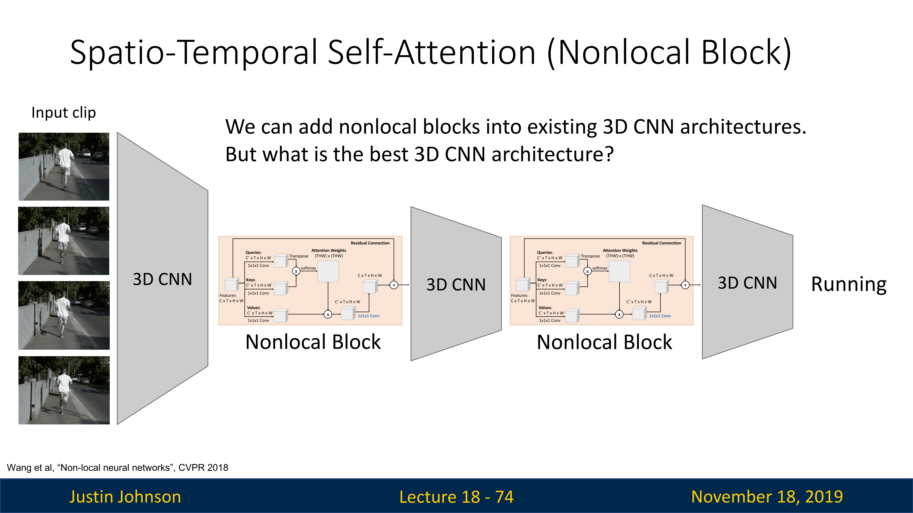

## I3D：二维网络膨胀成三维

我们有一个很好玩的想法，那就是从现有的二维网络膨胀，转变为三维网络，这是因为，在三维视觉发展起来之前，二维视觉就已经如日中天了，我们可以直接借鉴一些非常好的二维网络，而不必重新发明三维网络架构，我们对一些良好的二维网络进行调整，然后添加一个维度，就可以得到一个很好的三维网络了，这就是膨胀的想法

我们知道，二维网络中，有二维卷积核二维池化，我们将其改为三维卷积核三维池化

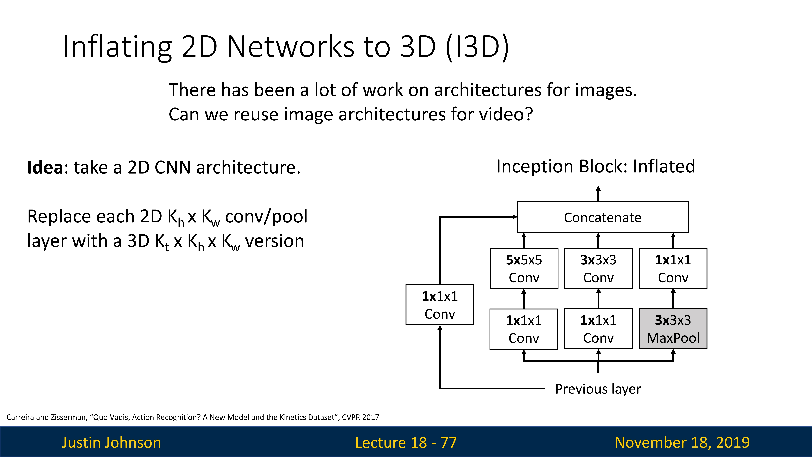

当然，更进一步，我们不仅仅可以膨胀网络架构，还可以膨胀训练权重，比如说我们在图像上训练了一组权重，我们可以将其转移至三维卷积网络中，我们只需要将每个卷积层的卷积核复制T次，将其复制到时间维度上，在实践中，这种操作是可行的，可以减少收敛时间

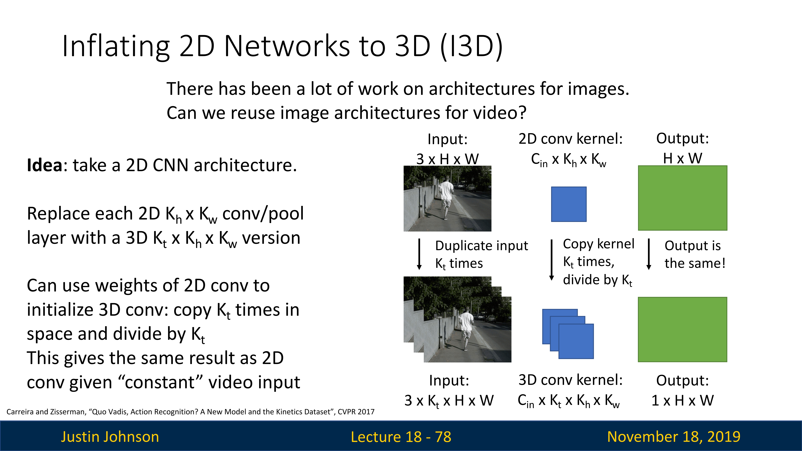

实际上，这种膨胀的方式会使得模型效果更好，下图中，蓝条是是从头开始对视频数据进行训练，橙条是从图像数据集上预训练然后膨胀，可以看到，使用预训练然后膨胀的方法，使得模型效果表现更好

# 可视化视频模型

我们在二维网络中进行可视化理解，同样的我们可以在三维网络中这样处理

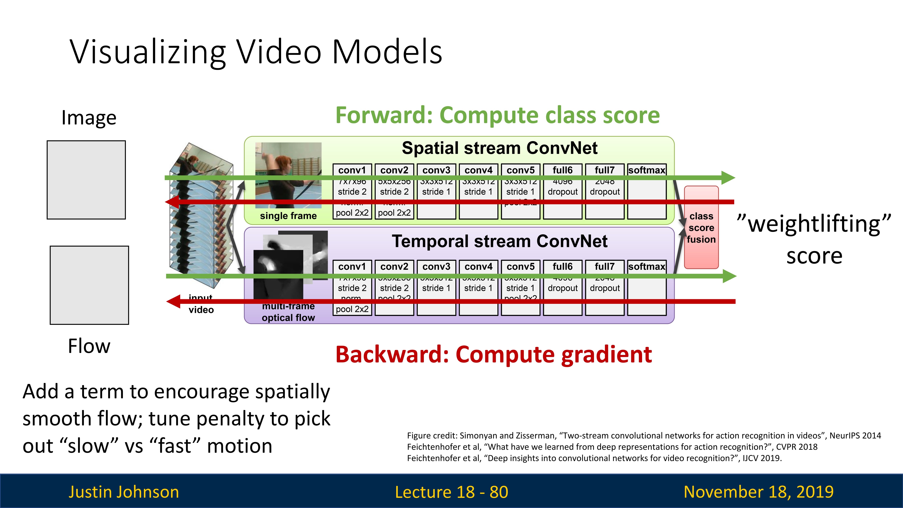

我们可以看到，随着网络的学习，网络所学习到的特征也越来越清晰，当然这些学习到的特征还是以一个小视频片段的形式表现的，或者说我们可以看到网络学习到了哪些行为

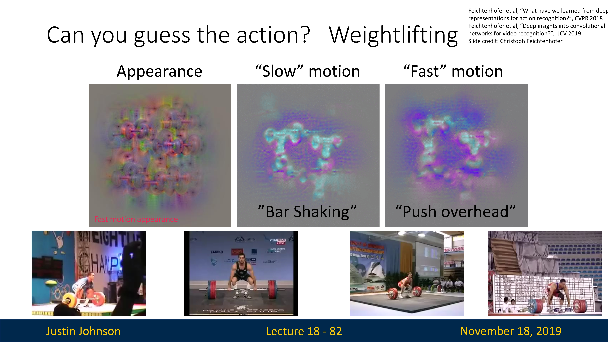

以课程中的例子，看起来网络在寻找举起杠铃这个动作（上图），或者在寻找化妆这个动作（下图）

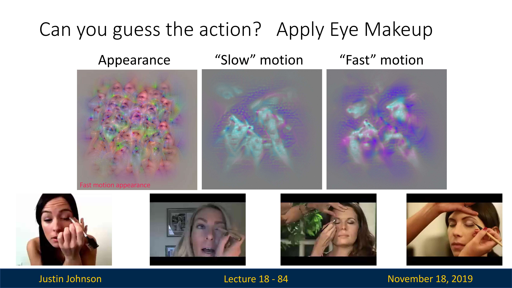

# 区别对待时间和空间：SlowFast Networks

这是一个2019年的新网络，在这之前，双流网络还是依赖于外部光流算法，或者我们可以换一种方法，不依赖于光流，这就是SlowFast Network，旨在解决视频中的时序建模和空间建模之间的不平衡问题。该模型通过同时处理慢速和快速帧来实现对视频中快速运动和细节以及慢速运动和上下文的有效建模。

这个网络仍然有两个分支，只不过他们都是对原始像素进行操作，而且时间分辨率不同，一个分支快，一个分支慢

慢的分支以非常低的帧速率运行，但是每一层处理中都会使用大量通道，为了可视化这个网络，我们使用三个维度，空间、时间、通道

快的分支使用更薄的网络，每层有更少的通道，所以可以高速运行

同时有横向连接，将信息从快速分支融合到慢速分支，然后在最后使用全连接层来预测

这种网络结合了目前讲到的所有的视频技术，比如说双流框架，膨胀手段，视频注意力机制

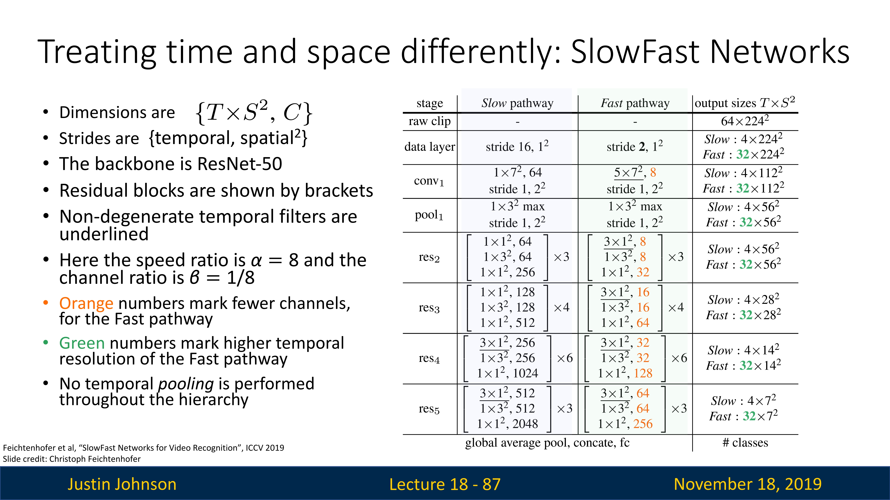

# 时空动作定位（Temporal Action Localization）

当然我们想做的另一个任务就是**时空动作定位（Temporal Action Localization）**，不但想识别出来动作，还想确定动作发生的时间跨度

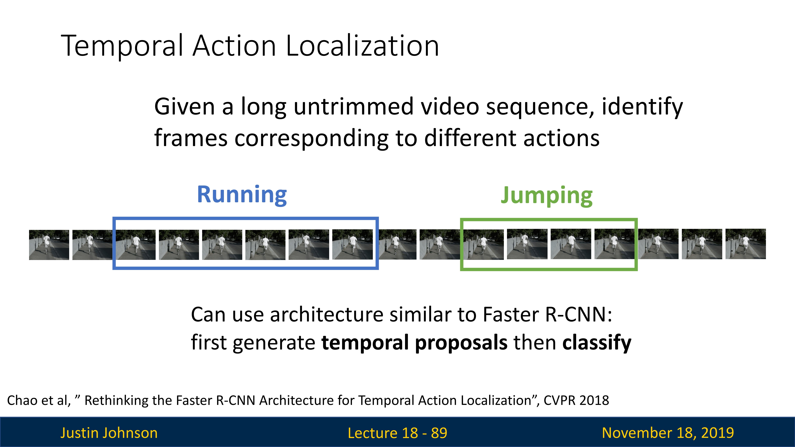

或许我们可以构建一个类似于Faster R-CNN的架构来执行这种操作，来得到一些Action Proposals，然后检测哪些地方可能包括动作

# 空间时间检测（Spatio-Temporal Detection）

或许这就是上面说的那种用在视频中的Faster R-CNN架构的网络，可以同时完成多重任务，比如说动作检测和时间定位

同时，AVA数据集也是2018年公开的数据集，可以用来完成模型效果评价

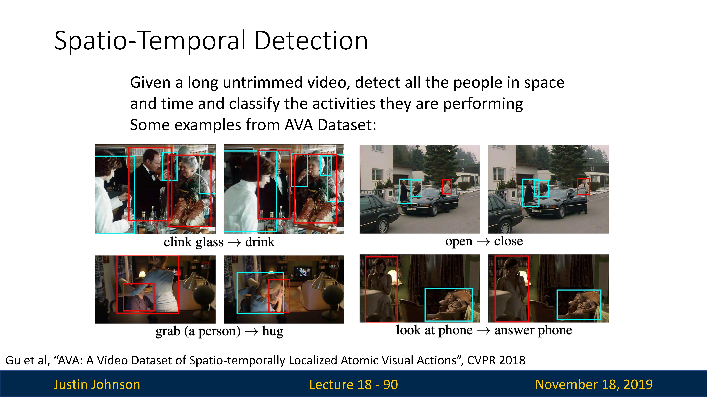